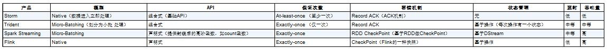

##### 1、Flink、Spark Streaming、Storm

    模型：Storm和Flink是真正的一条一条处理数据；而Trident（Storm的封装框架）和Spark Streaming其实都是小批处理，
    一次处理一批数据（小批量）。

    API：Storm和Trident都使用基础API进行开发，比如实现一个简单的sum求和操作；而Spark Streaming和Flink中都提供封
    装后的高阶函数，可以直接拿来使用，这样就比较方便了。

    保证次数：在数据处理方面，Storm可以实现至少处理一次，但不能保证仅处理一次，这样就会导致数据重复处理问题，所以针对
    计数类的需求，可能会产生一些误差；Trident通过事务可以保证对数据实现仅一次的处理，Spark Streaming和Flink也是如此。

    容错机制：Storm和Trident可以通过ACK机制实现数据的容错机制，而SparkStreaming和Flink可以通过CheckPoint机制实现容错机制。
    
    状态管理：Storm中没有实现状态管理，Spark Streaming实现了基于DStream的状态管理，而Trident和Flink实现了基于操作的状态管理。
    
    延时：表示数据处理的延时情况，因此Storm和Flink接收到一条数据就处理一条数据，其数据处理的延时性是很低的；而Trident和
    Spark Streaming都是小型批处理，它们数据处理的延时性相对会偏高。
    
    吞吐量：Storm的吞吐量其实也不低，只是相对于其他几个框架而言较低；Trident属于中等；而Spark Streaming和Flink的吞吐量是比较高的。

