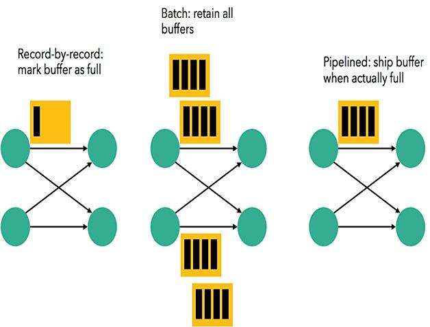

##### 1、Flink组件
    Flink中提供了3个组件，包括DataSource、Transformation和DataSink。

    DataSource：表示数据源组件，主要用来接收数据，目前官网提供了readTextFile、
    socketTextStream、fromCollection以及一些第三方的Source。

    Transformation：表示算子，主要用来对数据进行处理，比如Map、FlatMap、Filter、Reduce、Aggregation等。
    
    DataSink：表示输出组件，主要用来把计算的结果输出到其他存储介质中，比如writeAsText以及Kafka、Redis、
    Elasticsearch等第三方Sink组件。

    组装一个Flink Job，至少需要这3个组件。
    Flink Job=DataSource+Transformation+DataSink

    
    对于一个流处理系统，其节点间数据传输的标准模型是，在处理完成一条数据后，将其序列化到缓存中，并立刻通过网络传输到下一个节点，
    由下一个节点继续处理。而对于一个批处理系统，其节点间数据传输的标准模型是，在处理完成一条数据后，将其序列化到缓存中，当缓存
    写满时，就持久化到本地硬盘上；在所有数据都被处理完成后，才开始将其通过网络传输到下一个节点。

