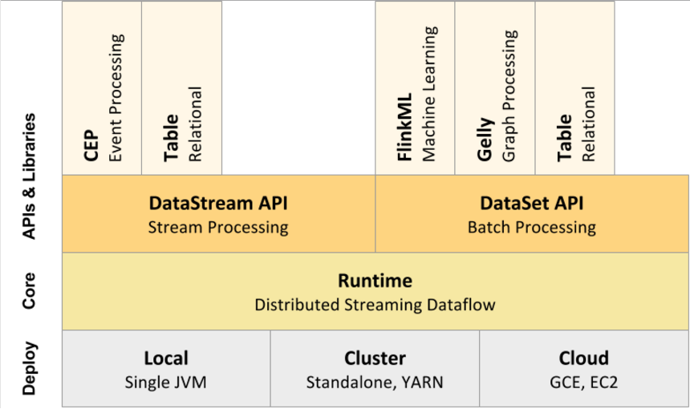

##### 1、Flink架构
    Flink架构可以分为4层，包括Deploy层、Core层、API层和Library层。

    Deploy层：该层主要涉及Flink的部署模式，Flink支持多种部署模式——本地、集群（Standalone/YARN）和云服务器（GCE/EC2）。
    
    Core层：该层提供了支持Flink计算的全部核心实现，为API层提供基础服务。
    
    API层：该层主要实现了面向无界Stream的流处理和面向Batch的批处理API，其中流处理对应DataStream API，批处理对应DataSet API。
    Library层：该层也被称为Flink应用框架层，根据API层的划分，在API层之上构建的满足特定应用的实现计算框架，
    
    也分别对应于面向流处理和面向批处理两类。面向流处理支持CEP（复杂事件处理）、基于SQL-like的操作（基于Table的关系操作）；
    面向批处理支持FlinkML（机器学习库）、Gelly（图处理）、Table 操作。

