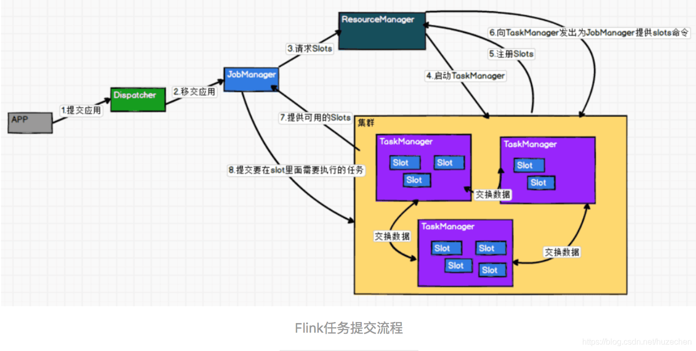

##### Flink面试题
    
###### 1、Flink最小计算单位是什么？
    slot
    

###### 2、Flink 的 checkpoint 存在哪里？
    可以是内存，文件系统，或者 RocksDB

###### 3、如果下级存储不支持事务，Flink怎么保证exactly-once？
    端到端的exactly-once对sink要求比较高，具体实现主要有幂等写入和事务性写入两种方式。
    幂等写入的场景依赖于业务逻辑，更常见的是用事务性写入。 
    而事务性写入又有预写日志（WAL）和两阶段提交（2PC）两种方式。 
    如果外部系统不支持事务，那么可以用预写日志的方式，把结果数据先当成状 态保存，然后在收到checkpoint完成的通知时一次性写入sink系统。

###### 4、Flink vs Spark Streaming
    数据模型：
    spark采用RDD模型，DStream是一组组小批数据RDD的集合；
    flink基本数据模型是数据流，以及时间Event序列；
    
    运行时架构：
    spark是批处理，将DAG划分为不同的stage，一个完成之后才可以进行下一个；
    flink是标准的流执行模式，一个事件在一个节点处理完之后可以直接发往下一个节点处理；
    
###### 5、checkpoint和spark比较
    Flink的checkpoint机制对比spark有什么不同和优势？
    spark streaming的checkpoint仅仅是针对driver的故障恢复做了数据和元数据的ck。
    而flink的ck机制采用轻量级的分布式快照，实现了每个算子的快照，以及流动中数据的快照。

###### 6、Flink CEP是啥？
