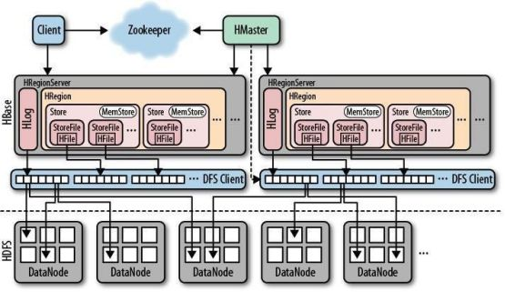

##### 1、HBase简介
    HBase是一个分布式的、面向列的开源数据库,一个结构化数据的分布式存储系统”,HBase在Hadoop之上提供了类似于Bigtable的能力。
* [HBase体系结构](src/main/scala/com/libin/doc/HBase体系结构.md)
* [HBase数据模型](src/main/scala/com/libin/doc/HBase数据模型.md)

* HBase架构图

##### 2、HBase操作
    

##### 3、HBase相关算法
* [HBase跳跃表](src/main/scala/com/libin/doc/HBase算法/跳跃表.md)
* [HBase LSM树](src/main/scala/com/libin/doc/HBase算法/LSM树.md)
* [HBase布隆过滤器](src/main/scala/com/libin/doc/HBase算法/布隆过滤器.md)

##### 4、HBase相关学习资料
* [HBase官网地址](http://hbase.apache.org/)
* [HBase gitbook地址](http://hbase.apache.org/book.html)

