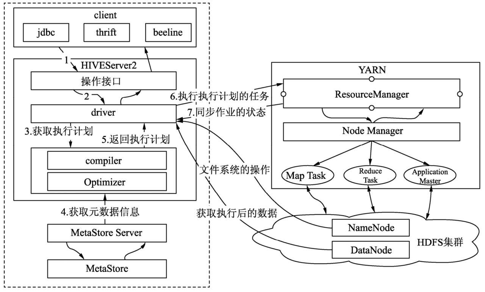

##### Hive架构

    客户端提交SQL作业到HiveServer2, HiveServer2会根据用户提交的SQL作业及数据库中现有的元数据信息生成一份可供计算引擎执行的计划。
    每个执行计划对应若干MapReduce作业，Hive会将所有的MapReduce作业都一一提交到YARN中，由YARN去负责创建MapReduce作业对应的子任务任务，并协调它们的运行。
    YARN创建的子任务会与HDFS进行交互，获取计算所需的数据，计算完成后将最终的结果写入HDFS或者本地。

