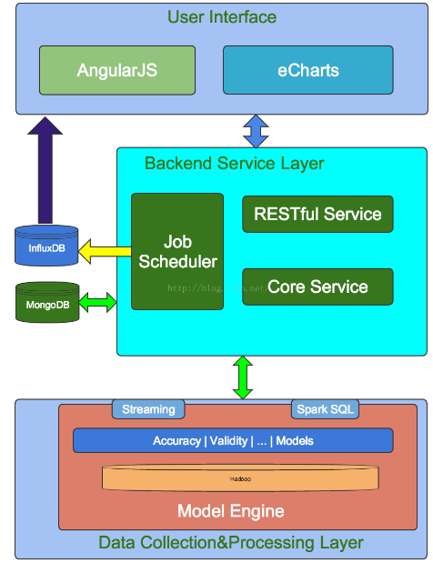
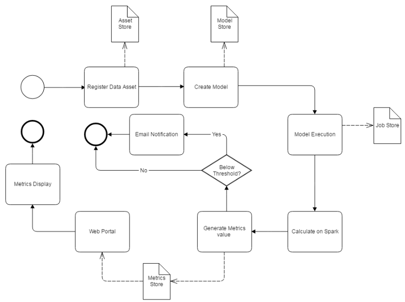

##### 1、简介
    Griffin这名字起的霸气：“狮鹫”。
    
    Griffin最初由ebay中国开发，2016年12月7日称为Apache孵化项目，2018年11月21日称为Apache顶级项目。
    
    Apache Griffin是一个开源的大数据数据质量监控方案，支持批处理和流处理两种模式。它提供了一个统一的过程由不同的角度来衡量数据质量，构建可信的数据资产。
    
    Apache Griffin提供了一组定义良好的数据质量模型，涵盖了大多数数据质量问题。它还定义了一组数据质量DSL，以帮助用户定义自己的质量标准。通过扩展DSL，用户可以在Apache Griffin中实现自己的特别的特性和功能。
    
    使用Apache Griffin一般分为三个步骤：
    
    定义数据质量检查规则
    执行数据质量检查规则
    展示数据质量报告, 分析数据质量
    
    
    数据质量模块是大数据平台中必不可少的一个功能组件，Apache Griffin（以下简称Griffin）是一个开源的大数据数据质量解决方案，它支持批处理和流模式两种数据质量检测方式，可以从不同维度（比如离线任务执行完毕后检查源端和目标端的数据数量是否一致、源表的数据空值数量等）度量数据资产，从而提升数据的准确度、可信度。
    
    Griffin是属于模型驱动的方案，基于目标数据集合或者源数据集(基准数据)，用户可以选择不同的数据质量维度来执行目标数据质量的验证。支持两种类型的数据源：batch数据和streaming数据。对于batch数据，我们可以通过数据连接器从Hadoop平台收集数据。对于streaming数据，我们可以连接到诸如Kafka之类的消息系统来做近似实时数据分析。在拿到数据之后，模型引擎将在spark集群中计算数据质量。

##### 2、系统架构
    Griffin 系统主要分为：数据收集处理层（Data Collection&Processing Layer）、后端服务层（Backend Service Layer）和用户界面（User Interface）
   
    
    系统数据处理分层结构图：
    
    在Griffin的架构中，主要分为Define、Measure和Analyze三个部分，如下图所示：

    
    各部分的职责如下：
    
    Define：主要负责定义数据质量统计的维度，比如数据质量统计的时间跨度、统计的目标（源端和目标端的数据数量是否一致，数据源里某一字段的非空的数量、不重复值的数量、最大值、最小值、top5的值数量等）
    Measure：主要负责执行统计任务，生成统计结果
    Analyze：主要负责保存与展示统计结果
    
    Griffin平台分为3个模块
    
    1、measure模块： 主要负责执行统计任务，生成统计结果
                                          将DSL解析为SparkSQL，然后提交任务到spark集群上运算，结果sink到hdfs上。
    
    2、service模块：1）提供measure配置通道，将measure的参数(监控的Hive表schema / 运算逻辑 / owner / 调度时间 etc)持久化
                                      2）提供job配置通道，将measure生成具体实例，sprak-submit
    
    3、ui模块：前端。

##### 3、系统处理流程图：

    
    GitHub地址：https://github.com/apache/griffin/tree/griffin-0.2.0-incubating-rc4
    
    代码模块
    measure（Scala编写，需要编译成jar包上传到HDFS，用于后续的Spark计算）
    service（Java编写，同时承担了对接ui的后端接口，以及定时调度、向livy提交spark程序的角色，以java -jar的方式启动Spring Boot服务）
    ui（前端界面，由Angular2开发，需要编译成静态文件，放在Apache或则Ngnix服务器上）
    
##### 4、 特性：
    度量：精确度、完整性、及时性、唯一性、有效性、一致性。
    异常监测：利用预先设定的规则，检测出不符合预期的数据，提供不符合规则数据的下载。
    异常告警：通过邮件或门户报告数据质量问题。
    可视化监测：利用控制面板来展现数据质量的状态。
    实时性：可以实时进行数据质量检测，能够及时发现问题。
    可扩展性：可用于多个数据系统仓库的数据校验。
    可伸缩性：工作在大数据量的环境中，目前运行的数据量约1.2PB(eBay环境)。
    自助服务：Griffin提供了一个简洁易用的用户界面，可以管理数据资产和数据质量规则；同时用户可以通过控制面板查看数据质量结果和自定义显示内容。
        
##### 5、 数据质量指标说明
    精确度：度量数据是否与指定的目标值匹配，如金额的校验，校验成功的记录与总记录数的比值。
    完整性：度量数据是否缺失，包括记录数缺失、字段缺失，属性缺失。
    及时性：度量数据达到指定目标的时效性。
    唯一性：度量数据记录是否重复，属性是否重复；常见为度量为hive表主键值是否重复。
    有效性：度量数据是否符合约定的类型、格式和数据范围等规则。
    一致性：度量数据是否符合业务逻辑，针对记录间的逻辑的校验，如：pv一定是大于uv的，订单金额加上各种优惠之后的价格一定是大于等于0的。

##### 6、优势
    可配置、可自定义的数据质量验证。
    基于spark的数据分析，可以快速计算数据校验结果。
    历史数据质量趋势可视化。

##### 7、缺陷
    1. 产品界面 英文
    2.没有账号登录 权限管控，任何人都可以删除其他人配置的指标
    3.调度只根据cron表达式开始执行，不能等待数据生成后再执行
    4.提供的JSON/YAML 方式，对用户来说太复杂
    5.没有时效性监控
    6.定义好的指标和任务 不能再次编辑修改
    7.没有同比 环比 和 触发报警规则， PS: 后续修改的 只能在后台手动添加报警机制
    8.任务失败告警缺失
    9.只能展示accuracy曲线，profiling没有展示
    10.配置profiling，accuracy时 不够灵活, 不能满足很多需求
    11.不能针对不同集群的表 提交到对应集群计算
    12.当天griffin只能通过bigdata keytab执行任务，添加监控的表 bigdata必须有访问权限
    13.访问hive metastore比较慢，显示字段容易卡

##### 8、参考：
    1、Apache Griffin 入门指南： https://griffin.apache.org/docs/quickstart-cn.html
    2、开源数据质量解决方案 Apache Griffin - 安装篇 ： https://zhuanlan.zhihu.com/p/38571446
    3、数据质量监控工具-Apache Griffin ：https://my.oschina.net/u/939952/blog/2998527
    