* [9.4、Flink Streaming]()
    - [1）、Flink如何保证数据仅且消费一次？]()
    - [2）、Flink如何做checkPoint检查点？分布式快照原理是啥?]()
    - [3）、Flink程序消费过慢如何解决？]()
    - [4）、统计实时流中某一单词出现的总个数（eg：比如一天某商品被点击的PV）？](../../../../bigdata-flink/src/main/scala/com/libin/data/flink/streaming/etl/GenCodeFromState.scala)
    - [5）、Flink中时间有几种？]()
    - [6）、Flink中窗口有几种？]()
    - [7）、Flink中state如何理解？状态机制?]()
    - [8）、Flink中Operator是啥？]()
    - [9）、Flink中StreamExecutionEnvironment初始化流程？]()
    - [10）、用过DataStream里面的哪些方法？]()
    - [11）、Flink程序调优？]()
    - [12）、Flink如何解决数据乱序问题？Watermark使用过么?EventTime+Watermark可否解决数据乱序问题?]()
    - [13）、Flink的checkpoint存储有哪些(状态存储)？]()
    - [14）、Flink如何实现exactly-once？]()
    - [15）、海量key去重,双十一场景,滑动窗口长度为1小时,滑动距离为10s,亿级别用户,如何计算UV？]()
    - [16）、Flink的checkpoint和spark streaming比较？]()
    - [17）、Flink CEP编程中当状态没有达到时候,数据会保存在哪里？]()
    - [18）、3种时间语义？]()
    - [19）、Flink面对高峰数据如何处理？]()
    - [20）、Flink程序运行慢如何优化处理？]()
    - [21）、Flink程序延迟高如何解决？]()
    - [22）、Flink如何做容错？]()
    - [23）、Flink有没有重启策略？说说有哪几种?]()
    - [24）、Flink分布式快照原理是什么?]()
    - [25）、Flink的Kafka连接器有什么特别的地方?]()
    - [26）、Flink的内存管理?]()
    - [27）、Flink序列化都有哪些?怎么实现的?]()
    - [28）、Flink的window出现了数据倾斜,如何解决?]()
    - [29）、Flink在使用聚合函数GroupBy、KeyBy、Distinct等函数出现数据热点如何解决?]()
    - [30）、Flink如何处理反压?和spark streaming和storm区别有了解么?]()
    - [31）、Flink的Operator Chains算子链了解么?]()
    - [32）、Flink什么时候会把Operator Chain在一起行程算子链?]()
    - [33）、Flink1.7特性?Flink1.9特性]()
    - [34）、Flink组件栈有哪些?]()
    - [35）、Flink运行需要依赖哪些组件?必须依赖Hadoop么?]()
    - [36）、Flink基础编程模型?]()
    - [37）、Flink集群有哪些角色?各有什么作用?]()
    - [38）、Flink中Task Slot概念?Slot和parallelism区别?]()
    - [39）、Flink中常用算子有哪些?]()
    - [40）、Flink分区策略?]()
    - [41）、Flink并行度如何设置?]()
    - [42）、Flink分布式缓存用过没?如何使用?]()
    - [43）、Flink广播变量,使用时候需要注意什么?]()
    - [44）、Flink Table&SQL熟悉不?TableEnvironment这个类有什么作用?]()
    - [45）、Flink SQL实现原理是什么?如何实现SQL的解析?]()
    - [46）、Flink如何支持流批一体的?]()
    - [47）、Flink如何支如何做到高效的数据转换?]()
    - [48）、Flink如何做内存管理?]()
    - [49）、Flink Job提交流程?]()
    - [50）、Flink的三层图结构是哪几个图?]()
    - [51）、Flink中JobManager在集群中扮演的角色?]()
    - [52）、Flink中JobManager在集群启动中扮演的角色?]()
    - [53）、Flink中TaskManager在集群中扮演的角色?]()
    - [54）、Flink中TaskManager在集群启动时候扮演的角色?]()
    - [55）、Flink计算资源的调度是如何实现的?]()
    - [56）、简述Flink的数据抽象以及数据交换过程?]()
    - [57）、FlinkSQL的实现原理?]()
    - [58）、Flink压测和监控?]()
    - [59）、有了Spark为啥还要用Flink?]()
    - [60）、Flink的应用架构有哪些?]()
    - [61）、Flink Barrier对齐?]()
    - [62）、Flink slot和cpu core区别?]()
    - [63）、JobGraph生成?]()
    - [64）、Flink和SparkStreaming区别?]()
    - [65）、Flink中什么场景会用到state?]()
    - [66）、Flink如何快速定位问题?]()
    - [67）、Flink中watermark 机制?]()
    - [68）、Flink集群有哪些角色？各自有什么作用？]()
    - [69）、Flink中多流Join?]()
    - [70）、Flink中两阶段提交?]()
    - [71）、Flink中多流checkpoint?]()
    - [72）、Flink中多流合并反压?]()
    - [73）、Flink中多流Join，数据延迟?]()
    - [74）、Flink中checkpoint存的数据是什么?]()
    - [75）、Flink中checkpoint和savepoint区别?]()
    - [76）、Flink中join类型?]()
    - [77）、Flink与SparkStreaming的优缺点?适用的场景?]()
    - [78）、Flink背压如何实现?]()
    - [79）、Flink如何取消state?1.7版本如如何取消?]()
    - [80）、Flink如何实现自定义sink?]()
    - [81）、Flink分布式缓存?]()
    - [82）、Flink计数器?]()
    - [83）、Flink的windows函数分区?]()
    - [84）、Flink限速消费?]()
    - [85）、Flink SQL Join方式?]()
    - [86）、Flink SQL解析方式?]()
    - [87)、Flink Window的分组？]()
    - [88)、Flink Window 的生命周期？清除？]()
    - [89)、Flink Window 的触发器？以及内置自定义触发器？]()
    - [90)、Flink Window 的窗口函数？]()  
    - [91)、Flink Window 的驱逐器Evictors？]() 
    - [92)、Flink Window 允许时延？]() 

---
###### [0）、Flink资料网址？]()
* [Flink GitHub地址](https://github.com/apache/flink)
* [Flink 官网地址](https://flink.apache.org/)
* [Flink 中文文档](https://nightlies.apache.org/flink/flink-docs-release-1.11/zh/)

###### [1）、Flink如何保证数据仅且消费一次？]()
    Flink是由source --> transformation --> sink三部分组成；也就是说Flink要实现ExactlyOnce语义与这三者脱不了干系；
    
    数据源Source，首先要支持ExactlyOnce，比如Kafka;
    接着需要对Flink开启checkpoint机制；即开启状态后端，保存其偏移量及中间状态数据；
    Sink端需要支持写覆盖也就是我们经常说的幂等性或者支持事务（两阶段提升）
    
    Flink读取Kafka数据中的checkpoint具体操作如下:
         使用FlinkKafkaConsumer，开启CheckPointing，偏移量会保存通过CheckPoint保存到StateBackend中，并且默认会将偏移量写入Kafka的特殊topic中，即：__consumer_offsets
         FlinkKafkaConsumr的setCommitOffsetsOnCheckpoints参数默认true，即将偏移量写入到Kafka特殊的Topic中，
         目的是为了监控或重启任务没有指定savePoint时可以接着一起的偏移量继续消费并且设置CheckpointingMode.EXACTLY_ONCE
    Barrier【隔离带】可以保证一个流水线中的所有算子都处理成功了，才会对该条数据做CheckPoint
    存储系统不支持覆盖的话，就得要支持事务，成功了提交事务和更新偏移量，如果失败可以回滚且不更新偏移量
    
###### [2）、Flink如何做checkPoint检查点？分布式快照原理是啥?]()
    Flink使用的检查点算法是分布式快照算法（基于Chandy-Lamport算法的分布式快照），将检查点的保存和数据分开处理，不需要暂停整个应用。
    检查点分界线(checkpoint barrier):
    Flink检查点算法用到了一种称为分界线(barrier)的特殊数据格式,用来把一条流上数据按照不同的检查点分开.
    分界线之前到来的数据导致的状态修改,都被包含在当前分界线所属的检查点中,而基于分界线之后的数据导致的所有修改,都被包含在之后的检查点中.

###### [3）、Flink程序消费过慢如何解决？]()
    常见消费过慢问题:
    1.代码问题,比如发生数据倾斜
    2.sink端阻塞,sink过慢
    3.source遇到峰值,流量激增
    4.程序运行资源过少,分区过少

###### [4）、统计实时流中某一单词出现的总个数（eg：比如一天某商品被点击的PV）？](../../../../bigdata-flink/src/main/scala/com/libin/data/flink/streaming/etl/GenCodeFromState.scala)
    详细见代码.    

###### [5）、Flink中时间有几种？]()
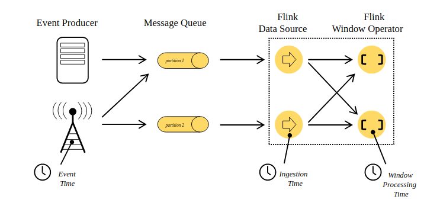  

    对于流式数据处理，最大的特点就是数据具有时间的属性，Flink根据时间的产生位置分为三种类型:
    1)事件生成时间（Event Time）:
        事件时间是每个独立事件在产生它的设备上发生的时间，这个时间在事件进入Flink之前就已经嵌入到事件中，时间顺序取决于事件产生的地方，和下游数据处理系统的时间无关。
    2)事件注入时间（Ingestion Time）、
        注入时间是数据进入Flink系统的时间，接入时间依赖Source Operator 所在主机的系统时钟。
        因为接入时间在数据接入过程生成后，时间戳不在发生变化，和后续处理数据的Operator所在机器的时钟没有关系，所以不会因为某台机器时钟不同步或网络延迟而导致计算结果不准确的问题。
    3)事件处理时间(Processing Time)。
        处理时间是指数据在操作算子计算过程中获取到的所在主机时间。当用户选择使用Processing Time 时，所有和时间相关的计算算子，
        例如Linux计算,在当前的任务中所有算子将直接使用其所在主机的系统时间。
    在Flink 中默认情况下使用Processing Time ,如果想用其它的时间类型，则在创建StreamExecutionEnvironment 中调用setStreamTimeCharacteristic()设定时间概念。

###### [6）、Flink中窗口有几种？]()
    滑动窗口（Tumbling Window，无重叠），滚动窗口（Sliding Window，有重叠），和会话窗口（Session Window，活动间隙）。

  

    1)、滚动时间窗口（Tumbling Time Window）
        翻滚窗口能将数据流切分成不重叠的窗口，每一个事件只能属于一个窗口。
        比如：统计每一分钟中用户购买的商品的总数，需要将用户的行为事件按每一分钟进行切分。
    2)、滚动计数窗口（Tumbling Count Window）
        滚动计数窗口会对窗口进行计算。
        比如：想要每100个用户购买行为事件统计购买总数，那么每当窗口中填满100个元素了，就会对窗口进行计算。   
    3)、滑动时间窗口（Sliding Time Window）
        滑动时间窗口是不间断的，需要平滑地进行窗口聚合，一个元素可以对应多个窗口。
        比如：我们可以每30秒计算一次最近一分钟用户购买的商品总数。 
    4)、滑动计数窗口（Sliding Count Window）
        每次滑动指定步数，然后做聚合统计。
        例如：计算每10个元素计算一次最近100个元素的购买总数。
    5)、会话窗口
        在用户交互事件流中，将事件聚合到会话窗口中（一段用户持续活跃的周期），由非活跃的间隙分隔开。
        比如：需要计算每个用户在活跃期间总共购买的商品数量，如果用户30秒没有活动则视为会话断开。
   
###### [7）、Flink中state如何理解？状态机制?]()
    state一般指一个具体的task/operator的状态。Flink中包含两种基础的状态：Keyed State和Operator State。
    1).Keyed State: 就是基于KeyedStream上的状态。这个状态是跟特定的key绑定的，对KeyedStream流上的每一个key，可能都对应一个state。
    2).Operator State: 记录每个Task对应的状态,整个operator只对应一个state。相比较而言，在一个operator上，可能会有很多个key，从而对应多个keyed state。
                    (eg:Flink中的Kafka Connector，就使用了operator state。它会在每个connector实例中，保存该实例中消费topic的所有(partition, offset)映射。)
    
    Keyed State和Operator State，可以以两种形式存在：原始状态和托管状态(Raw and Managed State)。
    1).原始状态(Raw State): 由用户自行管理状态具体的数据结构
    2).托管状态(Managed State): 托管状态是由Flink框架管理的状态，如ValueState, ListState, MapState等。
    框架在做checkpoint的时候，使用byte[]来读写状态内容。通常在DataStream上的状态推荐使用托管的状态，当实现一个用户自定义的operator时，会使用到原始状态。
    
    Keyed State:基于key/value的状态接口，这些状态只能用于keyedStream之上。keyedStream上的operator操作可以包含window或者map等算子操作。
                这个状态是跟特定的key绑定的，对KeyedStream流上的每一个key，都对应一个state。
    key/value下可用的状态接口：
        1).ValueState: 状态保存的是一个值，可以通过update()来更新，value()获取。
        2).ListState: 状态保存的是一个列表，通过add()添加数据，通过get()方法返回一个Iterable来遍历状态值。
        3).ReducingState: 这种状态通过用户传入的reduceFunction，每次调用add方法添加值的时候，会调用reduceFunction，最后合并到一个单一的状态值。
        4).MapState：即状态值为一个map。用户通过put或putAll方法添加元素。
    以上所述的State对象，仅仅用于与状态进行交互（更新、删除、清空等），而真正的状态值，有可能是存在内存、磁盘、或者其他分布式存储系统中。
    
    实际上，这些状态有三种存储方式: HeapStateBackend、MemoryStateBackend、FsStateBackend、RockDBStateBackend。
    1).MemoryStateBackend: state数据保存在java堆内存中，执行checkpoint的时候，会把state的快照数据保存到jobmanager的内存中。
    2).FsStateBackend: state数据保存在taskmanager的内存中，执行checkpoint的时候，会把state的快照数据保存到配置的文件系统中，可以使用hdfs等分布式文件系统。
    3).RocksDBStateBackend: RocksDB跟上面的都略有不同，它会在本地文件系统中维护状态，state会直接写入本地rocksdb中。
                         同时RocksDB需要配置一个远端的filesystem。RocksDB克服了state受内存限制的缺点，同时又能够持久化到远端文件系统中，比较适合在生产中使用。
                
    通过创建一个StateDescriptor，可以得到一个包含特定名称的状态句柄，可以分别创建ValueStateDescriptor、 ListStateDescriptor或ReducingStateDescriptor状态句柄。
    状态是通过RuntimeContext来访问的，因此只能在RichFunction中访问状态。这就要求UDF时要继承Rich函数，例如RichMapFunction、RichFlatMapFunction等。

###### [8）、Flink中Operator是啥？]()
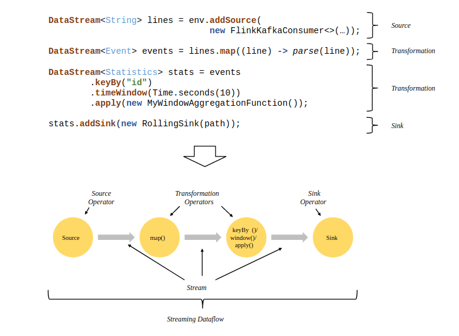   

    Task是Flink中执行的基本单位，Operator是算子（Transformation）。
    
    并行数据流(Parallel Dataflows): Flink中把整个流处理过程叫做Stream Dataflow,
        从数据源提取数据的操作叫做Source Operator,中间的map(),聚合、统计等操作可以统称为Tranformation Operators,最后结果数据的流出被称为sink operator。
        Flink的程序内在是并行和分布式的，数据流可以被分区成stream partitions，operators被划分为operator subtasks;这些subtasks在不同的机器或容器中分不同的线程独立运行。
        operator subtasks的数量是operator的并行计算数，程序不同的operator阶段可能有不同的并行数。
    
    数据在两个operator之间传递的时候有两种模式：
        1).one-to-one 模式：两个operator用此模式传递的时候，会保持数据的分区数和数据的排序；
        2).Redistributing模式：这种模式会改变数据的分区数；每个一个operator subtask会根据选择transformation把数据发送到不同的目标subtasks,
                           比如keyBy()会通过hashcode重新分区,broadcast()和rebalance()方法会随机重新分区；
            
    Tasks & Operator Chains:
        对于分布式计算，Flink封装operator subtasks链化为tasks;每个task由一个线程执行；把tasks链化有助于优化，它减少了开销线程和线程之间的交接和缓冲；增加了吞吐量和减少延迟时间；
        (eg:没链化之前, source和map是2个线程运行这2个task,链化之后,source和map合并为一个task，用一个线程执行,这样可以减少source operator和map operator两个线程之间的交接和缓存开销)
    
###### [9）、Flink中StreamExecutionEnvironment初始化流程？]()
    StreamExecutionEnvironment是一个任务的启动的入口
    StreamGraph 相关的代码主要在 org.apache.flink.streaming.api.graph 包中。
    构造StreamGraph的入口函数是 StreamGraphGenerator.generate(env, transformations)。
    该函数会由触发程序执行的方法StreamExecutionEnvironment.execute()调用到。

###### [10）、用过DataStream里面的哪些方法？]()
    map,flatmap,filter,keyby,reduce,fold,aggregations,window,windowAll,union

###### [11）、Flink程序调优？]()
    1.内存调优
    Flink是依赖内存计算，计算过程中内存不够对Flink的执行效率影响很大。可以通过监控GC（Garbage Collection），评估内存使用及剩余情况来判断内存是否变成性能瓶颈，并根据情况优化。
    2.设置并行度
    并行度控制任务的数量，影响操作后数据被切分成的块数。调整并行度让任务的数量和每个任务处理的数据与机器的处理能力达到最优。，一般并行度设置为集群CPU核数总和的2-3倍。
    1).算子层次
    一个算子、数据源和sink的并行度可以通过调用setParallelism方法来指定
    2).执行环境层次
    Flink程序运行在执行环境中。执行环境为所有执行的算子、数据源、data sink定义了一个默认的并行度。执行环境的默认并行度可以通过调用setParallelism方法指定。
    3).客户端层次
    并行度可以在客户端将job提交到Flink时设定。对于CLI客户端，可以通过“-p”参数指定并行度。例如：./bin/flink run -p 10 ../examples/WordCount-java.jar
    4).系统层次
    在系统级可以通过修改Flink客户端conf目录下的“flink-conf.yaml”文件中的“parallelism.default”配置选项来指定所有执行环境的默认并行度。
    3.配置进程参数
    Flink on YARN模式下，有JobManager和TaskManager两种进程。在任务调度和运行的过程中，JobManager和TaskManager承担了很大的责任。
    1).配置JobManager内存:JobManager负责任务的调度，以及TaskManager、RM之间的消息通信。当任务数变多，任务平行度增大时，JobManager内存都需要相应增大。
    2).配置TaskManager个数: 每个TaskManager每个核同时能跑一个task，所以增加了TaskManager的个数相当于增大了任务的并发度。在资源充足的情况下，可以相应增加TaskManager的个数，以提高运行效率。
    3). 配置TaskManager Slot数: 每个TaskManager多个核同时能跑多个task，相当于增大了任务的并发度。但是由于所有核共用TaskManager的内存，所以要在内存和核数之间做好平衡。
    4). 配置TaskManager内存: TaskManager的内存主要用于任务执行、通信等。当一个任务很大的时候，可能需要较多资源，因而内存也可以做相应的增加。
    4.解决数据倾斜
    5.Checkpoint 调优

###### [12）、Flink如何解决数据乱序问题？Watermark使用过么?EventTime+Watermark可否解决数据乱序问题?]()
    Watermark是Apache Flink为了处理EventTime 窗口计算提出的一种机制,本质上也是一种时间戳。
    watermark是用于处理乱序事件的，处理乱序事件通常用watermark机制结合window来实现。

###### [13）、Flink的checkpoint存储有哪些(状态存储)？]()
    这些状态有三种存储方式: HeapStateBackend、MemoryStateBackend、FsStateBackend、RockDBStateBackend。
    1).MemoryStateBackend: state数据保存在java堆内存中，执行checkpoint的时候，会把state的快照数据保存到jobmanager的内存中。
    2).FsStateBackend: state数据保存在taskmanager的内存中，执行checkpoint的时候，会把state的快照数据保存到配置的文件系统中，可以使用hdfs等分布式文件系统。
    3).RocksDBStateBackend: RocksDB跟上面的都略有不同，它会在本地文件系统中维护状态，state会直接写入本地rocksdb中。
                           同时RocksDB需要配置一个远端的filesystem。RocksDB克服了state受内存限制的缺点，同时又能够持久化到远端文件系统中，比较适合在生产中使用。

###### [14）、Flink如何实现exactly-once？]()
    Flink自1.4.0开始实现exactly-once的数据保证.
    Flink的checkpoint可以保证作业失败的情况下从最近一次快照进行恢复，也就是可以保证系统内部的exactly-once。
    但是，flink有很多外接系统，比如将数据写到kafka，一旦作业失败重启，offset重置，会消费旧数据，从而将重复的结果写到kafka。
    这个时候，仅靠系统本身是无法保证exactly-once的。系统之间的数据一致性一般要靠2PC协议来保证，flink的TwoPhaseCommitSinkFunction也是基于此实现的。
    
    Exactly-once VS At-least-once:
    算子做快照时，如果等所有输入端的barrier都到了才开始做快照，那么就可以保证算子的exactly-once；
    如果为了降低延时而跳过，从而继续处理数据，那么等barrier都到齐后做快照就是at-least-once了，因为这次的快照掺杂了下一次快照的数据，当作业失败恢复的时候，这些数据会重复作用系统，就好像这些数据被消费了两遍。
    注：对齐只会发生在算子的上端是join操作以及上游存在partition或者shuffle的情况，对于直连操作类似map、flatMap、filter等还是会保证exactly-once的语义。
    
    端到端的 exactly-once 对 sink 要求比较高，具体实现主要有幂等写入和事务性写入两种方式。幂等写入的场景依赖于业务逻辑，更常见的是用事务性写入。
    而事务性写入又有预写日志（WAL）和两阶段提交（2PC）两种方式。如果外部系统不支持事务，那么可以用预写日志的方式，把结果数据先当成状态保存，然后在收到 checkpoint 完成的通知时，一次性写入 sink 系统。
    
    端到端的Exactly once实现:
    以一个简单的flink读写kafka作为例子来说明（kafka0.11版本开始支持exactly-once语义）。
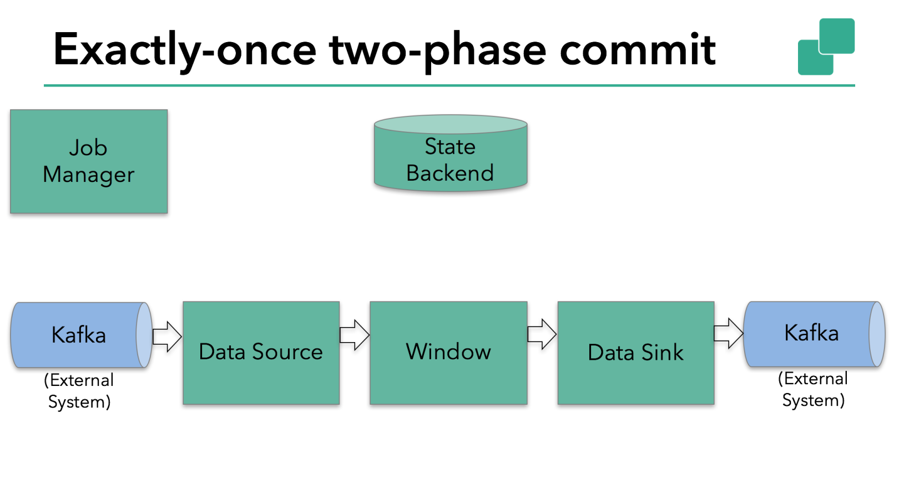
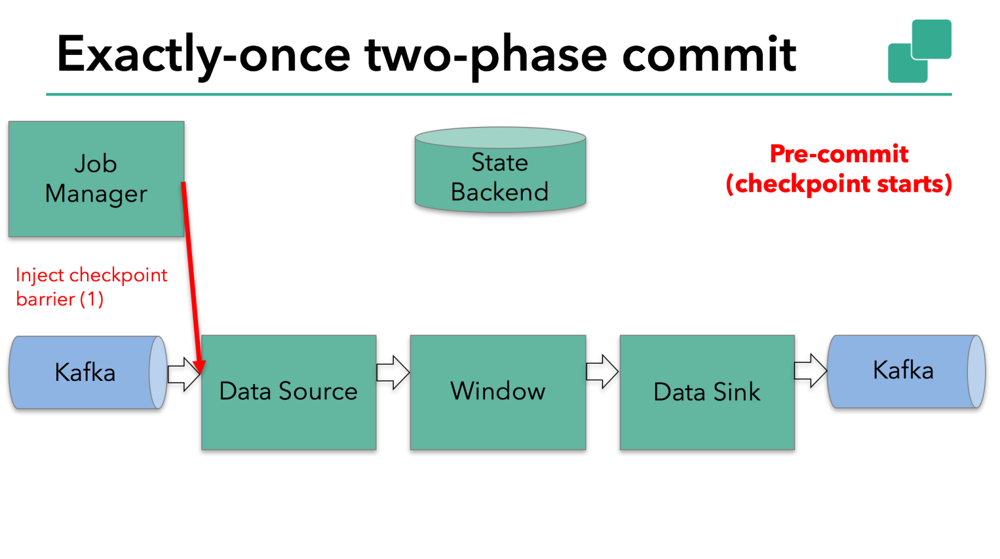

    上图由kafka source、window操作和kafka sink组成。
    为了保证exactly-once语义，作业必须在一次事务中将缓存的数据全部写入kafka。一次commit会提交两个checkpoint之间所有的数据。
    pre-commit阶段起始于一次快照的开始，即master节点将checkpoint的barrier注入source端，barrier随着数据向下流动直到sink端。barrier每到一个算子，都会出发算子做本地快照。
    如下图所示：

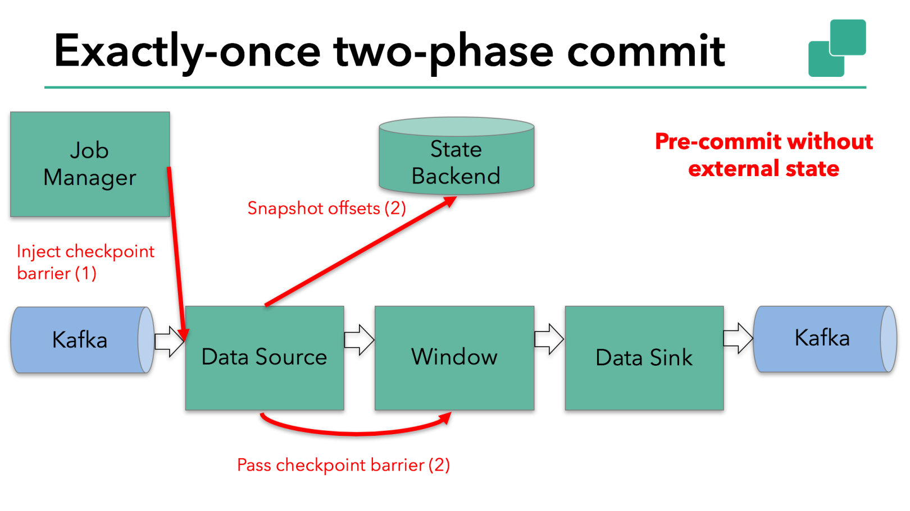   
    
    当状态涉及到外部系统时，需要外部系统支持事务操作来配合flink实现2PC协议，从而保证数据的exatly-once。这个时候，sink算子出了将自己的state写到后段，还必须准备好事务提交。

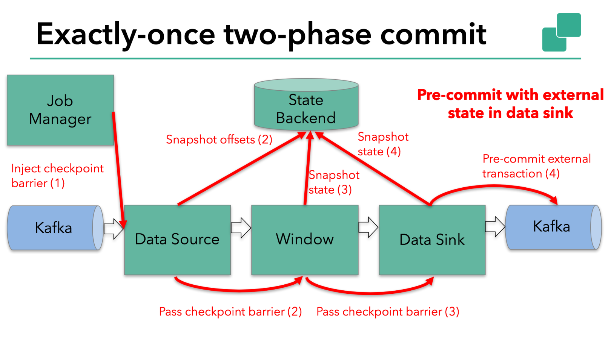   
    
    当所有的算子都做完了本地快照并且回复到master节点时，pre-commit阶段才算结束。这个时候，checkpoint已经成功，并且包含了外部系统的状态。如果作业失败，可以进行恢复。
    接下来是通知所有的算子这次checkpoint成功了，即2PC的commit阶段。source节点和window节点没有外部状态，所以这时它们不需要做任何操作。
    而对于sink节点，需要commit这次事务，将数据写到外部系统。

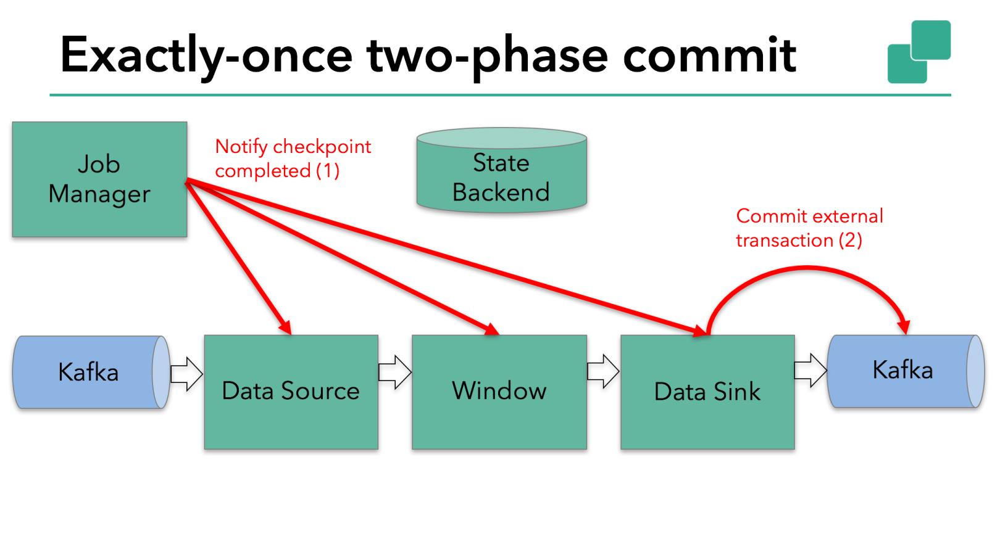   
    
    总的来说，流程如下：
    一旦所有的算子完成了它们的pre-commit，它们会要求一个commit。
    如果存在一个算子pre-commit失败了，本次事务失败，我们回滚到上次的checkpoint。
    一旦master做出了commit的决定，那么这个commit必须得到执行，就算宕机恢复也有继续执行。
    
    实现flink的2PC
    由于2PC协议比较复杂，所以flink对它做了抽象，即TwoPhaseCommitSinkFunction。可以通过以下四步实现：
    
        beginTransaction。开始一次事务，在目的文件系统创建一个临时文件。接下来我们就可以将数据写到这个文件。
        preCommit。在这个阶段，将文件flush掉，同时重起一个文件写入，作为下一次事务的开始。
        commit。这个阶段，将文件写到真正的目的目录。值得注意的是，这会增加数据可视的延时。
        abort。如果回滚，那么删除临时文件。
    如果pre-commit成功了但是commit没有到达算子旧宕机了，flink会将算子恢复到pre-commit时的状态，然后继续commit。
    我们需要做的还有就是保证commit的幂等性，这可以通过检查临时文件是否还在来实现。
    
    总结
    Flink依托checkpoint来实现端到端的一致性语义。
    这种方法的优势是不需要持久化传输中的数据，没有必要将每个阶段的计算都写到磁盘。
    Flink抽象了TwoPhaseCommitSinkFunction来帮助用户更好地实现exactly-once语义。
    自Flink 1.4.0，Pravega和Kafka 0.11都支持了exactly-once语义。
    Kafka 0.11在TwoPhaseCommitSinkFunction实现了事务支持，并且开销很小。

###### [15）、海量key去重,双十一场景,滑动窗口长度为1小时,滑动距离为10s,亿级别用户,如何计算UV？]()
    去重可以考虑使用布隆过滤器（Bloom Filter）来去重。

###### [16）、Flink的checkpoint和spark streaming比较？]()
    spark streaming 的 checkpoint 仅仅是针对 driver 的故障恢复做了数据和元数据的 checkpoint。
    flink 的 checkpoint 机制 要复杂了很多，它采用的是轻量级的分布式快照，实现了每个算子的快照，及流动中的数据的快照。

###### [17）、Flink CEP编程中当状态没有达到时候,数据会保存在哪里？]()
    在流式处理中，CEP 当然是要支持 EventTime 的，那么相对应的也要支持数据的迟到现象，也就是 watermark 的处理逻辑。
    CEP 对未匹配成功的事件序列的处理，和迟到数据是类似的。在 Flink CEP 的处理逻辑中，状态没有满足的和迟到的数据，都会存储在一个 Map 数据结构中，也就是说，
    如果我们限定判断事件序列的时长为 5 分钟，那么内存中就会存储 5 分钟的数据，这在我看来，也是对内存的极大损伤之一。

###### [18）、3种时间语义？]()
    流处理引擎通常为用户的应用程序提供三种数据处理语义：最多一次，至少一次和精确一次。
    1).最多一次（At-most-Once）：这种语义理解起来很简单，用户的数据只会被处理一次，不管成功还是失败，不会重试也不会重发。
    2).至少一次（At-least-Once）：这种语义下，系统会保证数据或事件至少被处理一次。如果发生错误或者丢失，那么会从源头重新发送一条然后进入处理系统。所以同一个事件或者消息会被处理很多次。
    3).精确一次（Exactly-Once）：表示每一条数据只会被精确地处理一次，不多也不少。
    ”精确一次“语义是Flink 1.4.0版本引入的一个重要特性，而且，Flink号称支持”端到端的精确一次“语义。
    
    这里解释一下”端到端的精确一次“，它指的是Flink应用从Source端开始到Sink端结束，数据必须经过的起始点和结束点。
    Flink自身是无法保证外部系统”精确一次“语义的，所以Flink若要实现所谓”端到端的精确一次“的要求，那么外部系统必须支持”精确一次“语义，然后借助Flink提供的分布式快照和两阶段提交才能实现。

    Flink在1.4版本引入了一个很重要得功能：两阶段提交，也即是TwoPhaseCommitSinkFunction。两阶段搭配特定得source和sink（特别是0.11版本kafka）使得”精确一次处理语义“成为可能。

###### [19）、Flink面对高峰数据如何处理？]()
    1.限流反压,设置消费速率
    2.增大作业并行度

###### [20）、Flink程序运行慢如何优化处理？]()
    1.增大作业并行度
    2.内存调优

###### [21）、Flink程序延迟高如何解决？]()
    1.内存调优
    2.代码逻辑调优

###### [22）、Flink如何做容错？]()
    Flink基于分布式快照与可部分重发的数据源实现了容错。用户可自定义对整个Job进行快照的时间间隔，当任务失败时，Flink会将整个Job恢复到最近一次快照，并从数据源重发快照之后的数据。
    
    Flink 容错机制的关键部分是为分布式数据系统建立一致性快照和操作状态。这些快照充当一致性检查点，在出现失败时，就可以回滚。
    Flink这种建立快照的机制在“分布式数据流中的轻量级异步快照” （http://arxiv.org/abs/1506.08603）中进行详细描述。
    它受“Chandy-Lamport algorithm”启发，并为Flink的执行模型做了适配。

###### [23）、Flink有没有重启策略？说说有哪几种?]()
    1).固定延迟重启策略（Fixed Delay Restart Strategy）
        固定延迟重启策略尝试给定次数重新启动作业。如果超过最大尝试次数，则作业最终会失败。在两次连续重启尝试之间，重启策略等待一段固定的时间。
    2).故障率重启策略（Failure Rate Restart Strategy）
        故障率重启策略在故障后重新启动作业，但是当failure rate超过（每个时间间隔的故障）时，作业最终会失败。在两次连续重启尝试之间，重启策略等待一段固定的时间。
    3).无重启策略（No Restart Strategy）
        作业直接失败，不尝试重启。
    4).Fallback重启策略（Fallback Restart Strategy）
        使用群集定义的重新启动策略。这对于启用检查点的流式传输程序很有帮助。默认情况下，如果没有定义其他重启策略，则选择固定延迟重启策略。

###### [24）、Flink分布式快照原理是什么?]()
    Flink 分布式快照的核心是 stream barriers。这些 barriers 被插入到数据流中，并作为数据流的一部分和记录一起向下游。Barriers 永远不会超过正常数据，数据流严格有序。
    一个 barrier 将数据流中的记录分割为进入当前快照的一组记录和进入下一个快照的记录。每个 barrier 都带有快照ID，并且 barrier 之前的记录都进入了此快照。
    Barriers 不会中断数据流，所以非常的轻量。多个不同快照的多个 barriers 可以同时在 stream 中出现，即多个快照可能同时创建。
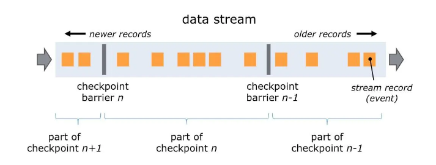   
  
    Stream barriers 在 source stream 的并行数据流中插入。当 snapshot n 被插入（计作Sn），Sn点是 source stream 中 snapshot 覆盖数据的位置。
    例如在 Apache Kafka 中，此位置表示某个分区中最后一条数据的偏移量（offset）。Sn点被发送给 checkpoint coordinator（Flink JobManger）。
    然后 barrier 继续移动。当中间算子从其所有的输入流（input stream）中收到 snapshot n 的 barrier 时，会向其所有输出流（outgoing stream）插入 snapshot n 的 barrier。
    一旦 Sink operator（流式DAG的末端）从其所有输入流中接受到 barrier n，向 checkpoint coordinator 确认 snapshot n 已完成，在所有 sinks 确认之后，该 snapshot 被认为已完成。
    一旦 snapshot n 完成，作业将永远不会再向 source 请求Sn之前的记录，因为这些记录已经都走完了整个拓扑图。
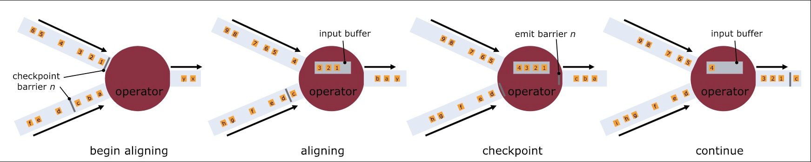      
    
    接收超过一个输入流的 operator 需要基于 snapshot barrier 对齐（align）输入。
    当算子从输入流接收到 snapshot 的 barrier n，就不能继续处理此数据流的后续数据，直到其接收到其余流的 barrier n为止。否则会将属于 snapshot n 和 snapshot n+1的数据混淆
    接收到 barrier n 的流的数据会被放在一个 input buffer 中，暂时不会处理
    当从最后一个流中接收到 barrier n 时，算子会 emit 所有暂存在 buffer 中的数据，然后自己向下游发送 Snapshot n
    最后算子恢复所有输入流数据的处理，优先处理输入缓存中的数据

###### [25）、Flink的Kafka连接器有什么特别的地方?]()
    1).基于Receiver的方式: 
        这种方式使用Receiver来获取数据。Receiver是使用Kafka的高层次Consumer API来实现的。
        receiver从Kafka中获取的数据都是存储在Spark Executor的内存中的，然后Spark Streaming启动的job回去处理那些数据。
    2).基于Direct的方式
        在Spark1.3中引入的，能够确保更加健壮的机制。替代掉使用Receiver来接收数据后，这种方式会周期性地查询Kafka，来获得每个topic+partition的最新的offset，从而定义每个batch的offset的范围。
        当处理数据的job启动时，就会使用Kafka的简单consumer api来获取Kafka指定offset范围的数据

###### [26）、Flink的内存管理?]()
    在flink中内存被分为三个部分，分别是Unmanaged区域，Managed区域，Network-Buffer区域
        1).Unmanaged区域: 是指flink不管理这部分区域，它的管理由JVM管理，用于存放User Code
        2).Managed区域: 是指flink管理这部分区域，它不受jvm管理不存在GC问题，用于存放Hashing,Sorting,Caching等数据
        3).Network-Buffer区域: 是指flink在进行计算时需要通过网络进行交换数据的区域。用于存放Shuffles，Broadcasts数据。
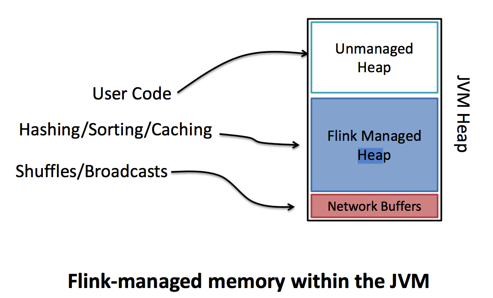  

    flink在JVM的heap内有自己的内存管理空间。
    为了解决大量对象在JVM的heap上创建会带来OOM和GC的问题，flink将大量使用的内存存放到堆外.
    flink在堆外有一块预分配的固定大小的内存块MemorySegment，flink会将对象高效的序列化到这块内存中。
    MemorySegment由许多小的内存cell组成，每个cell大小32kb，这也是flink分配内存的最小单位。你可以把 MemorySegment想象成是为Flink 定制的 java.nio.ByteBuffer。
    它的底层可以是一个普通的 Java 字节数组（byte[]），也可以是一个申请在堆外的 ByteBuffer。每条记录都会以序列化的形式存储在一个或多个MemorySegment中。
    如果MemorySegment中依然放不小所有的数据，flink会将数据写入磁盘，需要的时候再冲磁盘读出来。

###### [27）、Flink序列化都有哪些?怎么实现的?]()
    Flink实现了自己的序列化框架，Flink处理的数据流通常是一种类型，所以可以只保存一份对象Schema信息，节省存储空间。又因为对象类型固定，所以可以通过偏移量存取。
    Java支持任意Java或Scala类型，类型信息由TypeInformation类表示，TypeInformation支持以下几种类型：
        BasicTypeInfo:任意Java 基本类型或String类型。
        BasicArrayTypeInfo:任意Java基本类型数组或String数组。
        WritableTypeInfo:任意Hadoop Writable接口的实现类。
        TupleTypeInfo:任意的Flink Tuple类型(支持Tuple1 to Tuple25)。Flink tuples 是固定长度固定类型的Java Tuple实现。
        CaseClassTypeInfo: 任意的 Scala CaseClass(包括 Scala tuples)。
        PojoTypeInfo: 任意的 POJO (Java or Scala)，例如，Java对象的所有成员变量，要么是 public 修饰符定义，要么有 getter/setter 方法。
        GenericTypeInfo: 任意无法匹配之前几种类型的类。

###### [28）、Flink的window出现了数据倾斜,如何解决?]()
    这里window产生的数据倾斜指的是不同的窗口内积攒的数据量不同，主要是由源头数据的产生速度导致的差异。
    1)窗口触发前做预聚合
    针对window原始方式中在窗口触发前，是以数据积攒的方式进行的。所以针对这种方式可以在window后跟一个reduce方法，在窗口触发前采用该方法进行聚合操作（类似于MapReduce 中  map端combiner预处理思路）。
    2)重新设计窗口聚合的key
    
    Flink任务出现数据倾斜的直观表现是任务节点频繁出现反压，但是增加并行度后并不能解决问题；部分节点出现 OOM 异常，是因为大量的数据集中在某个节点上，导致该节点内存被爆，任务失败重启。
    1)产生数据倾斜的原因主要有 2 个方面：
        业务上有严重的数据热点，比如滴滴打车的订单数据中北京、上海等几个城市的订单量远远超过其他地区；
        技术上大量使用了 KeyBy、GroupBy 等操作，错误的使用了分组 Key，人为产生数据热点。
    2)因此解决问题的思路也很清晰：
        业务上要尽量避免热点 key 的设计，例如我们可以把北京、上海等热点城市分成不同的区域，并进行单独处理；
        技术上出现热点时，要调整方案打散原来的 key，避免直接聚合；此外 Flink 还提供了大量的功能可以避免数据倾斜。

###### [29）、Flink在使用聚合函数GroupBy、KeyBy、Distinct等函数出现数据热点如何解决?]()
    数据倾斜和数据热点是所有大数据框架绕不过去的问题。处理这类问题主要从3个方面入手：
    （1）在业务上规避这类问题
    例如一个假设订单场景，北京和上海两个城市订单量增长几十倍，其余城市的数据量不变。这时候我们在进行聚合的时候，北京和上海就会出现数据堆积，我们可以单独数据北京和上海的数据。
    （2）Key的设计上
    把热key进行拆分，比如上个例子中的北京和上海，可以把北京和上海按照地区进行拆分聚合。
    （3）参数设置
    Flink 1.9.0 SQL(Blink Planner) 性能优化中一项重要的改进就是升级了微批模型，即 MiniBatch。原理是缓存一定的数据后再触发处理，以减少对State的访问，从而提升吞吐和减少数据的输出量。

###### [30）、Flink如何处理反压?和spark streaming和storm区别有了解么?]()
    反压（backpressure）是实时计算应用开发中，特别是流式计算中，十分常见的问题。反压意味着数据管道中某个节点成为瓶颈，处理速率跟不上上游发送数据的速率，而需要对上游进行限速。
    由于实时计算应用通常使用消息队列来进行生产端和消费端的解耦，消费端数据源是 pull-based 的，所以反压通常是从某个节点传导至数据源并降低数据源（比如 Kafka consumer）的摄入速率。

###### [31）、Flink的Operator Chains算子链了解么?]()
    flink的整个数据处理流程是由一个个operator组成的，数据从源头开始传递给一个个operator进行链式处理，每一个处理逻辑就是一个operator，
    一个operator包含一个输入、一个处理逻辑、一个输出，operator是在TaskManager的slot中执行的，
    
    为了更高效地分布式执行，Flink会尽可能地将operator的subtask链接（chain）在一起形成task。每个task在一个线程中执行。
    一个slot就是一个线程，一个operator只能在一个slot中执行，一个slot中可以运行多个operator(同一个job任务)，
    flink会进行优化将多个operator放在一个slot中运行，它能减少线程之间的切换，减少消息的序列化/反序列化，减少数据在缓冲区的交换，减少了延迟的同时提高整体的吞吐量。

###### [32）、Flink什么时候会把Operator Chain在一起行程算子链?]()
    operator chain是指将满足一定条件的operator 链在一起，放在同一个task里面执行，是Flink任务优化的一种方式，
    相同并行度的one to one操作，在Flink中，这样相连的operator 链接在一起形成一个task，原来的operator成为里面的subtask。
    将operators链接成task是非常有效的优化：它能减少线程之间的切换和基于缓存区的数据交换，在减少时延的同时提升吞吐量。
    在同一个task里面的operator的数据传输变成函数调用关系，这种方式减少数据传输过程。常见的chain例如：source->map->filter
    
    OperatorChain的优点: 1).减少线程切换
                        2).减少序列化与反序列化
                        3).减少延迟并且提高吞吐能力
    OperatorChain组成条件: 1).上下游算子并行度一致
                          2).上下游算子之间没有数据shuffle

###### [33）、Flink1.7特性?Flink1.9特性]()
    Flink 的特性包含：
    支持高吞吐、低延迟、高性能的流处理 支持带有事件时间的窗口 （Window） 操作 支持有状态计算的 Exactly-once语义
    支持高度灵活的窗口 （Window） 操作，
    支持基于 time、count、session 以及 data-driven 的窗口操作
    支持具有 Backpressure 功能的持续流模型
    支持基于轻量级分布式快照（Snapshot）实现的容错 一个运行时同时支持 Batch on Streaming 处理和 Streaming 处理 Flink 在 JVM 内部实现了自己的内存管理
    支持迭代计算
    支持程序自动优化：避免特定情况下 Shuffle、排序等昂贵操作，中间结果有必要进行缓存
    
    Flink1.9的新特性
    支持hive读写，支持UDF
    Flink SQL TopN和GroupBy等优化
    Checkpoint跟savepoint针对实际业务场景做了优化
    Flink state查询

###### [34）、Flink组件栈有哪些?]()
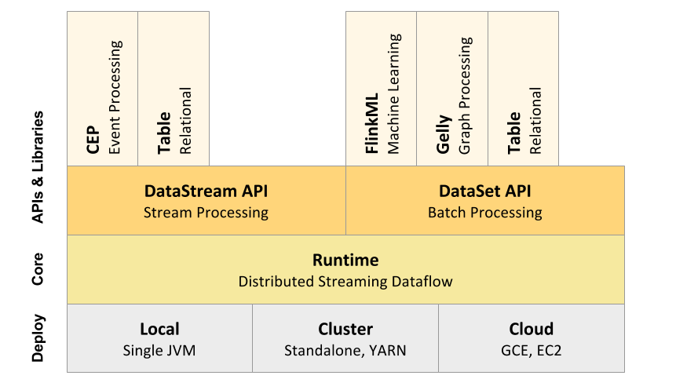 

    Flink的架构体系遵行分层架构设计的理念，基本上分为三层，API&Libraries层、Runtine核心层以及物理部署层。
    API层：API层主要实现了面向无界Stream的流处理和面向Batch的批处理API，其中面向流处理对应DataStream API，面向批处理对应DataSet API。
    Libraries层： 该层也可以称为Flink应用框架层，根据API层的划分，在API层之上构建的满足特定应用的实现计算框架，也分别对应于面向流处理和面向批处理两类。
                 面向流处理支持：CEP（复杂事件处理）、基于SQL-like的操作（基于Table的关系操作）；面向批处理支持：FlinkML（机器学习库）、Gelly（图处理）。
    Runtime核心层：负责对上层不同接口提供基础服务,支持分布式Stream作业的执行、JobGraph到ExecutionGraph的映射转换、任务调度等，将DataStream和DataSet转成统一的可执行的Task Operator.
    物理部署层：Flink 支持多种部署模式，本机，集群（Standalone/YARN）、云（GCE/EC2）、Kubenetes。

###### [35）、Flink运行需要依赖哪些组件?必须依赖Hadoop么?]()
    Flink可以完全独立于Hadoop，在不依赖Hadoop组件下运行。但是做为大数据的基础设施，Hadoop体系是任何大数据框架都绕不过去的。Flink可以集成众多Hadooop 组件，例如Yarn、Hbase、HDFS等等。例如，Flink可以和Yarn集成做资源调度，也可以读写HDFS，或者利用HDFS做检查点。

###### [36）、Flink基础编程模型?]()
    Flink 程序的基础构建单元是流（streams）与转换（transformations）。
    DataSet API 中使用的数据集也是一种流。数据流（stream）就是一组永远不会停止的数据记录流，而转换（transformation）是将一个或多个流作为输入，并生成一个或多个输出流的操作。
    执行时，Flink程序映射到streaming dataflows,由流(streams)和转换操作(transformation operators)组成。每个dataflow从一个或多个源(source)开始，在一个或多个接收器(sink)中结束。

    Flink核心是一个流式的数据流执行引擎，其针对数据流的分布式计算提供了数据分布、数据通信以及容错机制等功能。基于流执行引擎，Flink提供了诸多更高抽象层的API以便用户编写分布式任务：
    DataSet API: 对静态数据进行批处理操作，将静态数据抽象成分布式的数据集，用户可以方便地使用Flink提供的各种操作符对分布式数据集进行处理，支持Java、Scala和Python。
    DataStream API: 对数据流进行流处理操作，将流式的数据抽象成分布式的数据流，用户可以方便地对分布式数据流进行各种操作，支持Java和Scala。
    Table API: 对结构化数据进行查询操作，将结构化数据抽象成关系表，并通过类SQL的DSL对关系表进行各种查询操作，支持Java和Scala。
    
    此外，Flink还针对特定的应用领域提供了领域库，例如：
        Flink ML: Flink的机器学习库，提供了机器学习Pipelines API并实现了多种机器学习算法。
        Gelly: Flink的图计算库，提供了图计算的相关API及多种图计算算法实现。

###### [37）、Flink集群有哪些角色?各有什么作用?]()
    JobManager：
        JobManager是Flink系统的协调者，它负责接收Flink Job，调度组成Job的多个Task的执行。同时，JobManager还负责收集Job的状态信息，并管理Flink集群中从节点TaskManager。
    TaskManager：
        TaskManager也是一个Actor，它是实际负责执行计算的Worker，在其上执行Flink Job的一组Task。
        每个TaskManager负责管理其所在节点上的资源信息，如内存、磁盘、网络，在启动的时候将资源的状态向JobManager汇报。
    Client：
        当用户提交一个Flink程序时，会首先创建一个Client，该Client首先会对用户提交的Flink程序进行预处理，并提交到Flink集群中处理，
        所以Client需要从用户提交的Flink程序配置中获取JobManager的地址，并建立到JobManager的连接，将Flink Job提交给JobManager。
        Client会将用户提交的Flink程序组装一个JobGraph， 并且是以JobGraph的形式提交的。一个JobGraph是一个Flink Dataflow，它由多个JobVertex组成的DAG。
        其中，一个JobGraph包含了一个Flink程序的如下信息：JobID、Job名称、配置信息、一组JobVertex等。

###### [38）、Flink中Task Slot概念?Slot和parallelism区别?]()
    worker: 每一个worker(TaskManager)是一个JVM进程，它可能会在独立的线程上执行一个或多个subtask。
    slots: 为了控制一个worker能接收多少个task，worker通过task slot来进行控制（一个worker至少一个task slot）。每个task slot表示TaskManager拥有资源的一个固定大小的子集。
           假如一个TaskManager有三个slot，那么它会将其管理的内存分成三份给各个slot。不会涉及到CPU的隔离，slot目前仅仅用来隔离task的受管理的内存。
    
    Flink程序的执行具有并行、分布式的特性。
    一个特定operator的subtask的个数被称之为其parallelism(并行度)。
    Stream在operator之间传输数据的形式可以是one-to-one(forwarding)的模式也可以是redistributing的模式，具体是哪一种形式，取决于operator的种类。
    
    slot 和 parallelism关系:
        slot 是指 taskmanager 的并发执行能力。
        parallelism 是指 taskmanager 实际使用的并发能力。

###### [39）、Flink中常用算子有哪些?]()
    Flink中的算子是将一个或多个DataStream转换为新的DataStream，可以将多个转换组合成复杂的数据流拓扑。
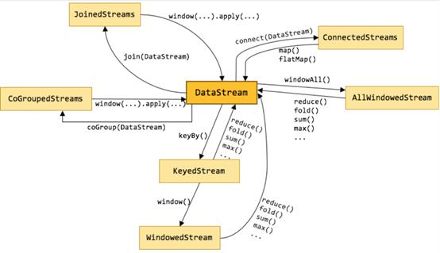 
    
    map[DataStream --> DataStream]：输入一个参数产生一个参数，map的功能是对输入的参数进行转换操作。
    flatMap[DataStream --> DataStream]：输入一个参数，产生0、1或者多个输出，这个多用于拆分操作
    keyBy[DataSteam --> DataStream]：逻辑地将一个流拆分成不相交的分区，每个分区包含具有相同key的元素，在内部以hash的形式实现的。以key来分组。
    reduce[KeyedStream --> DataStream]：滚动和并操作，合并当前元素和上一次合并的元素结果。
    fold[KeyedStream --> DataStream]：用一个初始的一个值，与其每个元素进行滚动合并操作。
    window[KeyedStream --> DataStream]：windows是在一个分区的KeyedStreams中定义的，windows根据某些特性将每个key的数据进行分组（例如：在5s内到达的数据）。

###### [40）、Flink分区策略?]()
    目前Flink支持8种分区策略：
    1).GlobalPartitioner： 数据会被分发到下游算子的第一个实例中进行处理。
    2).ShufflePartitioner ：数据会被随机分发到下游算子的每一个实例中进行。
    3).RebalancePartitioner： 数据会被循环发送到下游的每一个实例中进行处理。
    4).RescalePartitioner ：这种分区器会根据上下游算子的并行度，循环的方式输出到下游算子的每个实例。
    5).BroadcastPartitioner ：广播分区会将上游数据输出到下游算子的每个实例中。适合于大数据集和小数据集做Jion的场景。
    6).ForwardPartitioner：用于将记录输出到下游本地的算子实例。它要求上下游算子并行度一样。
    7).KeyGroupStreamPartitioner ：Hash 分区器。会将数据按Key的Hash值输出到下游算子实例中。
    8).CustomPartitionerWrapper：用户自定义分区器。需要用户自己实现 Partitioner 接口，来定义自己的分区逻辑。

###### [41）、Flink并行度如何设置?]()
    TaskManager 和 Slot:
        Flink的每个TaskManager为集群提供solt。 solt的数量通常与每个TaskManager节点的可用CPU内核数成比例。一般情况下你的slot数是你每个节点的cpu的核数。
    并行度(Parallel):
        一个Flink程序由多个任务组成(source、transformation和 sink)。 一个任务由多个并行的实例(线程)来执行， 一个任务的并行实例(线程)数目就被称为该任务的并行度。
    并行度(Parallel)的设置:
        一个任务的并行度设置可以从多个层次指定
        1).Operator Level（算子层次）
        一个算子、数据源和sink的并行度可以通过调用 setParallelism()方法来指定
        DataStream<Tuple2<String, Integer>> dataStream = env
                        .socketTextStream("localhost", 9999)
                        .flatMap(new Splitter())
                        .keyBy(0)
                        .timeWindow(Time.seconds(5))
                        .sum(1)
                        .setParallelism(5);
        2).Execution Environment Level（执行环境层次）
            StreamExecutionEnvironment env = StreamExecutionEnvironment.getExecutionEnvironment();
            env.setParallelism(5);
        3).Client Level（客户端层次）:
            并行度可以在客户端将job提交到Flink时设定。
            对于CLI客户端，可以通过-p参数指定并行度
            ./bin/flink run -p 10 WordCount-java.jar
        4).System Level（系统层次）（尽量不使用）
            在系统级可以通过设置flink-conf.yaml文件中的parallelism.default属性来指定所有执行环境的默认并行度

###### [42）、Flink分布式缓存用过没?如何使用?]()
    Flink提供了一个分布式缓存，类似于hadoop，可以使用户在并行函数中很方便的读取本地文件，并把它放在taskmanager节点中，防止task重复拉取。
    此缓存的工作机制如下：程序注册一个文件或者目录(本地或者远程文件系统，例如hdfs或者s3)，通过ExecutionEnvironment注册缓存文件并为它起一个名称。
    当程序执行，Flink自动将文件或者目录复制到所有taskmanager节点的本地文件系统，仅会执行一次。
    用户可以通过这个指定的名称查找文件或者目录，然后从taskmanager节点的本地文件系统访问它。

###### [43）、Flink广播变量,使用时候需要注意什么?]()
    在Flink中，同一个算子可能存在若干个不同的并行实例，计算过程可能不在同一个Slot中进行，不同算子之间更是如此，
    因此不同算子的计算数据之间不能像Java数组之间一样互相访问，而广播变量Broadcast便是解决这种情况的。
    
    我们可以把广播变量理解为是一个公共的共享变量，我们可以把一个dataset 数据集广播出去，然后不同的task在节点上都能够获取到，这个数据在每个节点上只会存在一份。

###### [44）、Flink Table&SQL熟悉不?TableEnvironment这个类有什么作用?]()
    TableEnvironment是Table API和SQL集成的核心概念。
    它负责：
    A)在内部catalog中注册表
    B)注册外部catalog
    C)执行SQL查询
    D)注册用户定义（标量，表或聚合）函数
    E)将DataStream或DataSet转换为表
    F)持有对ExecutionEnvironment或StreamExecutionEnvironment的引用

###### [45）、Flink SQL实现原理是什么?如何实现SQL的解析?]()
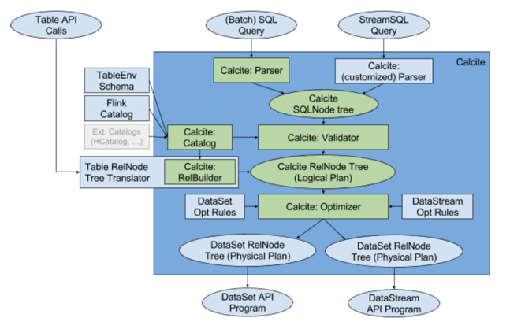   
    
    StreamSQL API的执行原理如下：
    1、用户使用对外提供Stream SQL的语法开发业务应用；
    2、用calcite对StreamSQL进行语法检验，语法检验通过后，转换成calcite的逻辑树节点；最终形成calcite的逻辑计划；
    3、采用Flink自定义的优化规则和calcite火山模型、启发式模型共同对逻辑树进行优化，生成最优的Flink物理计划；
    4、对物理计划采用janino codegen生成代码，生成用低阶API DataStream 描述的流应用，提交到Flink平台执行

###### [46）、Flink如何支持流批一体的?]()
    Flink设计者认为：有限流处理是无限流处理的一种特殊情况，它只不过在某个时间点停止而已。Flink通过一个底层引擎同时支持流处理和批处理。

###### [47）、Flink如何支如何做到高效的数据转换?]()
    在一个运行的application中，它的tasks在持续交换数据。TaskManager负责做数据传输。
    TaskManager的网络组件首先从缓冲buffer中收集records，然后再发送。也就是说，records并不是一个接一个的发送，而是先放入缓冲，然后再以batch的形式发送。
    这个技术可以高效使用网络资源，并达到高吞吐。类似于网络或磁盘 I/O 协议中使用的缓冲技术。

###### [48）、Flink如何做内存管理?]()
    Flink 并不是将大量对象存在堆上，而是将对象都序列化到一个预分配的内存块上，这个内存块叫做 MemorySegment，它代表了一段固定长度的内存（默认大小为 32KB），也是 Flink 中最小的内存分配单元，并且提供了非常高效的读写方法。
    可以把 MemorySegment 想象成是为 Flink 定制的 java.nio.ByteBuffer。
    底层可以是一个普通的 Java 字节数组（byte[]），也可以是一个申请在堆外的 ByteBuffer。每条记录都会以序列化的形式存储在一个或多个MemorySegment中。
    Flink 中的 Worker 名叫 TaskManager，是用来运行用户代码的 JVM 进程。TaskManager 的堆内存主要被分成了三个部分：
  
    
    Network Buffers: 一定数量的32KB大小的 buffer，主要用于数据的网络传输。在 TaskManager 启动的时候就会分配。
                     默认数量是 2048 个，可以通过 taskmanager.network.numberOfBuffers 来配置。
    Memory Manager Pool: 这是一个由 MemoryManager 管理的，由众多MemorySegment组成的超大集合。
                         Flink 中的算法（如 sort/shuffle/join）会向这个内存池申请 MemorySegment，将序列化后的数据存于其中，使用完后释放回内存池。默认情况下，池子占了堆内存的 70% 的大小。
    Remaining (Free) Heap: 这部分的内存是留给用户代码以及 TaskManager 的数据结构使用的。因为这些数据结构一般都很小，所以基本上这些内存都是给用户代码使用的。
                            从GC的角度来看，可以把这里看成的新生代，也就是说这里主要都是由用户代码生成的短期对象。

###### [49）、Flink Job提交流程?]()
    通用提交流程（ResourceManager未指定）
    步骤如下：
    1.application提交时，被dispatcher分发器将job提交给JobManager
    2.JobManager向资源管理器ResourceManager申请资源（插槽slot，每个slot为一个线程）
    3.ResourceManager注册空闲的slot
    4.由JobManager将slot分配给TaskManager
    5.job开始执行
    
    运行在yarn上的提交流程
    Flink 任务提交后，Client 向 HDFS 上传 Flink 的 Jar 包和配置，之后向 YarnResourceManager 提交任务，ResourceManager 分配 Container 资源并通知对应的
    NodeManager 启动 ApplicationMaster，ApplicationMaster 启动后加载 Flink 的 Jar 包和配置构建环境，然后启动 JobManager，之后 ApplicationMaster 向
    ResourceManager申请资源启动 TaskManager ， ResourceManager 分 配 Container 资 源 后 ， 由ApplicationMaster 通 知 资 源 所 在 节 点 的 NodeManager 
    启动 TaskManager ，NodeManager 加载 Flink 的 Jar 包和配置构建环境并启动 TaskManager，TaskManager 启动后向 JobManager 发送心跳包，
    并等待JobManager 向其分配任务。

###### [50）、Flink的三层图结构是哪几个图?]()
    Flink Job的提交流程 用户提交的Flink Job会被转化成一个DAG任务运行，分别是：StreamGraph、JobGraph、ExecutionGraph，
    Flink中JobManager与TaskManager，JobManager与Client的交互是基于Akka工具包的，是通过消息驱动。
    整个Flink Job的提交还包含着ActorSystem的创建，JobManager的启动，TaskManager的启动和注册。
    
    一个Flink任务的DAG生成计算图大致经历以下三个过程：
    StreamGraph 最接近代码所表达的逻辑层面的计算拓扑结构，按照用户代码的执行顺序向StreamExecutionEnvironment添加StreamTransformation构成流式图。
    JobGraph 从StreamGraph生成，将可以串联合并的节点进行合并，设置节点之间的边，安排资源共享slot槽位和放置相关联的节点，上传任务所需的文件，设置检查点配置等。相当于经过部分初始化和优化处理的任务图。
    ExecutionGraph 由JobGraph转换而来，包含了任务具体执行所需的内容，是最贴近底层实现的执行图。

###### [51）、Flink中JobManager在集群中扮演的角色?]()
    JobManager 负责整个 Flink 集群任务的调度以及资源的管理，从客户端中获取提交的应用，然后根据集群中 TaskManager 上 TaskSlot 的使用情况，为提交的应用分配相应的 TaskSlot 资源并命令 TaskManager 启动从客户端中获取的应用。
    JobManager 相当于整个集群的 Master 节点，且整个集群有且只有一个活跃的 JobManager ，负责整个集群的任务管理和资源管理。
    JobManager 和 TaskManager 之间通过 Actor System 进行通信，获取任务执行的情况并通过 Actor System 将应用的任务执行情况发送给客户端。
    同时在任务执行的过程中，Flink JobManager 会触发 Checkpoint 操作，每个 TaskManager 节点 收到 Checkpoint 触发指令后，完成 Checkpoint 操作，所有的 Checkpoint 协调过程都是在 Fink JobManager 中完成。
    当任务完成后，Flink 会将任务执行的信息反馈给客户端，并且释放掉 TaskManager 中的资源以供下一次提交任务使用。    

###### [52）、Flink中JobManager在集群启动中扮演的角色?]()
    JobManager的职责主要是接收Flink作业，调度Task，收集作业状态和管理TaskManager。它包含一个Actor，并且做如下操作：
    RegisterTaskManager: 它由想要注册到JobManager的TaskManager发送。注册成功会通过AcknowledgeRegistration消息进行Ack。
    SubmitJob: 由提交作业到系统的Client发送。提交的信息是JobGraph形式的作业描述信息。
    CancelJob: 请求取消指定id的作业。成功会返回CancellationSuccess，否则返回CancellationFailure。
    UpdateTaskExecutionState: 由TaskManager发送，用来更新执行节点(ExecutionVertex)的状态。成功则返回true，否则返回false。
    RequestNextInputSplit: TaskManager上的Task请求下一个输入split，成功则返回NextInputSplit，否则返回null。
    JobStatusChanged： 它意味着作业的状态(RUNNING, CANCELING, FINISHED,等)发生变化。这个消息由ExecutionGraph发送。

###### [53）、Flink中TaskManager在集群中扮演的角色?]()
    TaskManager 相当于整个集群的 Slave 节点，负责具体的任务执行和对应任务在每个节点上的资源申请和管理。
    客户端通过将编写好的 Flink 应用编译打包，提交到 JobManager，然后 JobManager 会根据已注册在 JobManager 中 TaskManager 的资源情况，将任务分配给有资源的 TaskManager节点，然后启动并运行任务。
    TaskManager 从 JobManager 接收需要部署的任务，然后使用 Slot 资源启动 Task，建立数据接入的网络连接，接收数据并开始数据处理。同时 TaskManager 之间的数据交互都是通过数据流的方式进行的。
    可以看出，Flink 的任务运行其实是采用多线程的方式，这和 MapReduce 多 JVM 进行的方式有很大的区别，Flink 能够极大提高 CPU 使用效率，在多个任务和 Task 之间通过 TaskSlot 方式共享系统资源，每个 TaskManager 中通过管理多个 TaskSlot 资源池进行对资源进行有效管理。

###### [54）、Flink中TaskManager在集群启动时候扮演的角色?]()
    TaskManager的启动流程较为简单： 启动类：org.apache.flink.runtime.taskmanager.TaskManager 
    核心启动方法 ： selectNetworkInterfaceAndRunTaskManager 启动后直接向JobManager注册自己，注册完成后，进行部分模块的初始化。

###### [55）、Flink计算资源的调度是如何实现的?]()
    TaskManager中最细粒度的资源是Task slot，代表了一个固定大小的资源子集，每个TaskManager会将其所占有的资源平分给它的slot。
    通过调整 task slot 的数量，用户可以定义task之间是如何相互隔离的。每个 TaskManager 有一个slot，也就意味着每个task运行在独立的 JVM 中。
    每个 TaskManager 有多个slot的话，也就是说多个task运行在同一个JVM中。
    而在同一个JVM进程中的task，可以共享TCP连接（基于多路复用）和心跳消息，可以减少数据的网络传输，也能共享一些数据结构，一定程度上减少了每个task的消耗。 
    每个slot可以接受单个task，也可以接受多个连续task组成的pipeline.

###### [56）、简述Flink的数据抽象以及数据交换过程?]()
    Flink 为了避免JVM的固有缺陷例如java对象存储密度低，FGC影响吞吐和响应等，实现了自主管理内存。MemorySegment就是Flink的内存抽象。
    默认情况下，一个MemorySegment可以被看做是一个32kb大的内存块的抽象。这块内存既可以是JVM里的一个byte[]，也可以是堆外内存（DirectByteBuffer）。
    在MemorySegment这个抽象之上，Flink在数据从operator内的数据对象在向TaskManager上转移，预备被发给下个节点的过程中，使用的抽象或者说内存对象是Buffer。
    对接从Java对象转为Buffer的中间对象是另一个抽象StreamRecord。

###### [57）、FlinkSQL的实现原理?]()
    Flink 将 SQL 校验、SQL 解析以及 SQL 优化交给了Apache Calcite。Calcite 在其他很多开源项目里也都应用到了，
    譬如 Apache Hive, Apache Drill, Apache Kylin, Cascading。Calcite 在新的架构中处于核心的地位
    构建抽象语法树的事情交给了 Calcite 去做。SQL query 会经过 Calcite 解析器转变成 SQL 节点树，通过验证后构建成 Calcite 的抽象语法树（也就是图中的 Logical Plan）。另一边，Table API 上的调用会构建成 Table API 的抽象语法树，并通过 Calcite 提供的 RelBuilder 转变成 Calcite 的抽象语法树。然后依次被转换成逻辑执行计划和物理执行计划。
    在提交任务后会分发到各个 TaskManager 中运行，在运行时会使用 Janino 编译器编译代码后运行。

###### [58）、Flink压测和监控?]()
    一，产生数据流的速度如果过快，而下游的算子消费不过来的话，会产生背压。
    背压的监控可以使用 Flink Web UI(localhost:8081) 来可视化监控，一旦报警就能知道。
    二，设置 watermark 的最大延迟时间这个参数，如果设置的过大，可能会造成 内存的压力。
    可以设置最大延迟时间小一些，然后把迟到元素发送到侧输出流中去。
    三，还有就是滑动窗口的长度如果过长，而滑动距离很短的话，Flink 的性能会下降的很厉害。
    我们主要通过时间分片的方法，将每个元素只存入一个“重叠窗 口”，这样就可以减少窗口处理中状态的写入

###### [59）、有了Spark为啥还要用Flink?]()
    实时处理方面优于spark
    

###### [60）、Flink的应用架构有哪些?]()
    Deploy 层：该层主要涉及了Flink的部署模式，Flink 支持包括local、Standalone、Cluster、Cloud等多种部署模式。
    Runtime 层：Runtime层提供了支持 Flink 计算的核心实现，比如：支持分布式 Stream 处理、JobGraph到ExecutionGraph的映射、调度等等，为上层API层提供基础服务。
    API层：API 层主要实现了面向流（Stream）处理和批（Batch）处理API，其中面向流处理对应DataStream API，面向批处理对应DataSet API
    Libraries层：该层称为Flink应用框架层，根据API层的划分，在API层之上构建的满足特定应用的实现计算框架，也分别对应于面向流处理和面向批处理两类。
    面向流处理支持：CEP（复杂事件处理）、基于SQL-like的操作（基于Table的关系操作）；面向批处理支持：FlinkML（机器学习库）、Gelly（图处理）。

###### [61）、Flink Barrier对齐?]()
    一个Barrier把数据流分割成两部分：一部分进入到当前快照，另一部分进入到下一个快照。每个Barrier都带有快照ID，并且Barrier之前的数据都进入了此快照。Barrier不会干扰数据流处理，所以非常轻量。多个不同快照的多个Barrier会在流中同时出现，即多个快照可能会同时被创建。
 

    Barrier随着正常数据继续往下流动，当一个operator从其所有的输入流都接收到snapshot n的Barrier时，它会向其所有输出流插入一个标识（也叫snapshot n）的Barrier。当sink operator（即DAG流的终点）从其输入流接收到所有的Barrier n时，表示这一批数据处理完成，它会向checkpoint coordinator发送消息确认snapshot n已完成。当所有sink都确认了这个snapshot，则标识本次处理已成功，该snapshot被标识为已完成。
 

    基于Stream Aligning操作能够实现Exactly Once语义，但是也会给流处理应用带来延迟，因为为了排列对齐Barrier，会暂时缓存一部分Stream的记录到Buffer中，尤其是在数据流并行度很高的场景下可能更加明显，通常以最迟对齐Barrier的一个Stream为处理Buffer中缓存记录的时刻点。在Flink中，提供了一个开关，选择是否使用Stream Aligning，如果关掉则Exactly Once会变成At least once。

###### [62）、Flink slot和cpu core区别?]()
    Flink中每一个worker(TaskManager)都是一个JVM进程，它可能会在独立的线程（slot）上执行一个或多个 subtask。Flink 的每个 TaskManager 为集群提供 slot。
    slot 的数量通常与每个 TaskManager 节点的可用 CPU 内核数成比例，一般情况下 slot 的数量就是每个节点的 CPU 的核数。
    Slot的数量与CPU-core的数量一致为好。但考虑到超线程，可以让slotNumber=2*cpuCore。
    指定了每个TaskManager内存 为3G 那么一个TM里面有3个Slot，每个Slot 分到1G内存 。

###### [63）、JobGraph生成?]()
    StreamGraph 和 JobGraph 都是在 Client 端生成的
    JobGraph 的相关数据结构主要在 org.apache.flink.runtime.jobgraph 包中。构造 JobGraph 的代码主要集中在 StreamingJobGraphGenerator 类中，入口函数是 StreamingJobGraphGenerator.createJobGraph()。

###### [64）、Flink和SparkStreaming区别?]()
    1).架构模型上：
    Spark Streaming 在运行时的主要角色包括：Master、Worker、Driver、Executor，Flink 在运行时主要包含：Jobmanager、Taskmanager和Slot。
    Spark Streaming 的task运行依赖driver和executor和worker，driver和excutor还依赖于集群管理器Standalone或者yarn等。
    Spark Streaming 是微批处理，运行的时候需要指定批处理的时间，每次运行 job 时处理一个批次的数据；
 

    Flink运行时主要是JobManager、TaskManage和TaskSlot。
    Flink是基于事件驱动的，事件可以理解为消息。事件驱动的应用程序是一种状态应用程序，它会从一个或者多个流中注入事件，通过触发计算更新状态，或外部动作对注入的事件作出反应。
 

    2).任务调度上:
    Spark Streaming的调度分为构建 DGA 图，划分 stage，生成 taskset，调度 task等步骤
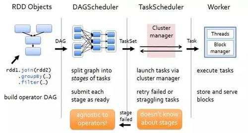   

    Flink首先会生成 StreamGraph，接着生成 JobGraph，然后将 jobGraph 提交给 Jobmanager 由它完成 jobGraph 到 ExecutionGraph 的转变，最后由 jobManager 调度执行。
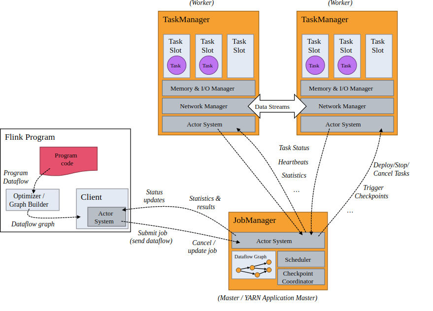    

    3).时间机制上：
    flink 支持三种时间机制事件时间，注入时间，处理时间，同时支持 watermark 机制处理滞后数据。
    Spark Streaming 只支持处理时间，Structured streaming则支持了事件时间和watermark机制。
    
    4).容错机制上：
    二者保证exactly-once的方式不同。
    spark streaming 通过保存offset和事务的方式。
    Flink则使用两阶段提交协议来解决这个问题。

###### [65）、Flink中什么场景会用到state?]()
    Flink流计算中可能有各种方式来保存状态：
    1).窗口操作
    2).使用了KV操作的函数
    3).继承了CheckpointedFunction的函数
    
###### [66）、Flink如何快速定位问题?]()
    “一压二查三指标，延迟吞吐是核心。时刻关注资源量 ,  排查首先看 GC。”
    一压是指背压，遇到问题先看背压的情况，
    二查就是指 checkpoint ，对齐数据的时间是否很长，state 是否很大，这些都是和系统吞吐密切相关的，
    三指标就是指 Flink UI 那块的一些展示，我们的主要关注点其实就是延迟和吞吐，系统资源，还有就是 GC logs。

    看反压：通常最后一个被压高的 subTask 的下游就是 job 的瓶颈之一。
    看 Checkpoint 时长：Checkpoint 时长能在一定程度影响 job 的整体吞吐。
    看核心指标：指标是对一个任务性能精准判断的依据，延迟指标和吞吐则是其中最为关键的指标。
    资源的使用率：提高资源的利用率是最终的目的。

###### [67）、Flink中watermark 机制?]()
    Watermark 本质是 Flink 中衡量 EventTime 进展的一个机制，主要用来处理乱序数据。
    

###### [68）、Flink集群有哪些角色？各自有什么作用？]()
    Flink 程序在运行时主要有 TaskManager，JobManager，Client三种角色。
    1.JobManager扮演着集群中的管理者Master的角色，它是整个集群的协调者，负责接收Flink Job，协调检查点，Failover 故障恢复等，同时管理Flink集群中从节点TaskManager。
    a. JobManager 接收待执行的 application。application 包含一个 JobGraph 和 JAR （包含所有需要的classes,libraries 和其他资源）。
    b. JobManager 将 JobGraph 转成 ExecutionGraph，ExecutionGraph中包含可以并发执行的 tasks。
    c. JobManager 向 ResourceManager 申请需要的资源（TaskManager slots），一旦分配到足够的slots，则分发 tasks 到 TaskManager 执行。
    d. 执行期间，JobManager 负责中央协调，如协调checkpoint等
    2.TaskManager是实际负责执行计算的Worker，在其上执行Flink Job的一组Task，每个TaskManager负责管理其所在节点上的资源信息，如内存、磁盘、网络，在启动的时候将资源的状态向JobManager汇报。
    a. 启动之后，TaskManager 向 ResourceManager 注册 slots 数，当接收到 ResourceManager 的分配通知后，会向 JobManager 提供一个或多个slots
    b. 紧接着 JobManager 将 tasks 分配到 slots 执行。
    c. 执行期间，不同的 TaskManager 之间会进行数据交换
    3.Client是Flink程序提交的客户端，当用户提交一个Flink程序时，会首先创建一个Client，该Client首先会对用户提交的Flink程序进行预处理，并提交到Flink集群中处理，所以Client需要从用户提交的Flink程序配置中获取JobManager的地址，并建立到JobManager的连接，将Flink Job提交给JobManager。

###### [69）、Flink中多流Join?](../../../../bigdata-flink/src/main/scala/com/libin/data/flink/streaming/etl/GenCodeFromJoin.scala)
    代码

###### [70）、Flink中两阶段提交?]()
    EXACTLY_ONCE简称EOS，指每条输入消息只会影响最终结果一次，而非处理一次。
    Flink支持EOS实际是对Flink内部来说的，对于外部系统（端到端）则有较强的限制。
        1）、外部系统写入支持幂等写
        2）、外部系统支持以事务方式写入
    Flink在1.4.0版本引入了TwoPhaseCommitSinkFunction接口，并在Kafka Producer的connector中实现了它，支持了对外部Kafka Sink的EXACTLY_ONCE语义。
    Kafka在0.11版本之前只能保证At-Least-Once或At-Most-Once语义，从0.11版本开始，引入了幂等发送和事务，从而开始保证EXACTLY_ONCE语义。

    为了实现Producer的幂等语义，Kafka引入了Producer ID（即PID）和Sequence Number。
    每个新的Producer在初始化的时候会被分配一个唯一的PID，该PID对用户完全透明而不会暴露给用户。
    
    Producer发送每条消息<Topic, Partition>对于Sequence Number会从0开始单调递增，broker端会为每个<PID, Topic, Partition>维护一个序号，
    每次commit一条消息此序号加一，对于接收的每条消息，如果其序号比Broker维护的序号（即最后一次Commit的消息的序号）大1以上，则Broker会接受它，否则将其丢弃：
        序号比Broker维护的序号大1以上，说明存在乱序。
        序号比Broker维护的序号小，说明此消息以及被保存，为重复数据。
    
    幂等性机制仅解决了单分区上的数据重复和乱序问题，对于跨session和所有分区的重复和乱序问题不能得到解决。于是需要引入事务。
    
    事务是指所有的操作作为一个原子，要么都成功，要么都失败，而不会出现部分成功或部分失败的可能。
    
    为了解决跨session和所有分区不能EXACTLY-ONCE问题，Kafka从0.11开始引入了事务。
    
    两阶段提交指的是一种协议，经常用来实现分布式事务，可以简单理解为预提交+实际提交，
    一般分为协调器Coordinator(以下简称C)和若干事务参与者Participant(以下简称P)两种角色。
    
    Flink在1.4.0版本引入了TwoPhaseCommitSinkFunction接口，封装了两阶段提交逻辑，
    并在Kafka Sink connector中实现了TwoPhaseCommitSinkFunction，依赖Kafka版本为0.11+

    flink使用两阶段提交协议:
            1、预提交。预提交是所有的算子全部完成checkpoint，并JM会向所有算子发通知说这次checkpoint完成。
            2、正式提交。flink负责向kafka写入数据的算子也会正式提交之前写操作的数据。在任务运行中的任何阶段失败，都会从上一次的状态恢复，所有没有正式提交的数据也会回滚。
    
    Pre-commit失败，将恢复到最近一次CheckPoint位置
    一旦pre-commit完成，必须要确保commit也要成功

###### [71）、Flink中多流checkpoint?]()
    参考24

###### [72）、Flink中多流合并反压?]()
    反压意味着数据管道中某个节点成为瓶颈，处理速率跟不上上游发送数据的速率，而需要对上游进行限速。
    实时计算应用通常使用消息队列来进行生产端和消费端的解耦，消费端数据源是 pull-based 的，所以反压通常是从某个节点传导至数据源并降低数据源（比如 Kafka consumer）的摄入速率。

###### [73）、Flink中多流Join，数据延迟?]()
    使用Flink state缓存前面的流(RocksDb，保留到磁盘，而非内存)，会导致非常大的checkpoint和显著的背压。
    
    多流Join是实时处理难点，常见问题面临关联流时差大（可能数天）、关联类型多样（左外关联、自关联等）、数据量级不一致。
    
    Flink Regular Join：用Flink常规SQL关联，Flink SQL执行引擎会将数据缓存在state中，再根据sql关联语义进行关联；
    Flink State Join：利用Flink API自定义的state数据结构进行关联。将两条流数据都存储在state中，当某条流数据到来时，从另一个state中取出对应的key数据关联后下发；
    Flink外存Join：利用高速缓存进行关联，比如Redis、HBase、Tair等，当某条流到来时，从另一条流的外存中取出对应key数据关联后下发，与“Flink State Join”类似，用高速缓存替代state；
    窗口Join：Flink Windows Join 都是 Inner Join,两个流join时，先做join操作，形成JoinedStream，然后再指定Window，最后接着join后的transform操作。
    
        inputStream1:DataStream[(Long,String,Int)] = ...
        inputStream2:DataStream[(String,Long,Int)] = ...
        //通过DataStream Join方法将两个数据流关联
        inputStream1.join(inputStream2)
        //指定inputStream1的关联Key
        .where(_._1) 
        //指定inputStream2的关联Key
        .equalTo(_._2)/
        //指定Window Assigner
        .window(TumblingEventTimeWindows.of(Time.milliseconds(10)))
        .apply(<JoinFunction>) //指定窗口计算函数
        
    根据窗口的不同，数据计算的方式不同:
    滚动窗口关联：Tumbling Window Join
    滑动窗口关联：Sliding Window Join
    会话窗口关联：Session Window Join
    间隔关联：Interval Join : 间隔关联与其他窗口关联不同，间隔关联的数据元素关联范围不依赖窗口划分，而是通过DataStream元素的时间加上或减去指定Interval作为关联窗口，
                            然后和另外一个DataStream的数据元素时间在窗口内进行Join操作。
                            
        //创建黑色元素数据集
        val blackStream: DataStream[(Int, Long)] = env.fromElements((2, 21L), (4, 1L), (5, 4L))
        //创建白色元素数据集
        val whiteStream: DataStream[(Int, Long)] = env.fromElements((2, 21L), (1, 1L), (3, 4L))
        //通过Join方法将两个数据集进行关联
        val windowStream: DataStream[String] = blackStream.keyBy(_._1)
        //调用intervalJoin方法关联另外一个DataStream
        .intervalJoin(whiteStream.keyBy(_._1))
        //设定时间上限和下限
         .between(Time.milliseconds(-2), Time.milliseconds(1))
         .process(new ProcessWindowFunciton())
        //通过单独定义ProcessWindowFunciton实现ProcessJoinFunction
        class ProcessWindowFunciton extends ProcessJoinFunction[(Int, Long), (Int, Long), String] {
            override def processElement(in1: (Int, Long), in2: (Int, Long), 
                                        context: ProcessJoinFunction[(Int, Long), (Int, Long), String]#Context, 
                                        collector: Collector[String]): Unit = {
                collector.collect(in1  + ":" + (in1._2 + in2._2))
            }
        }

###### [74）、Flink中checkpoint存的数据是什么?]()
    Flink提供了Exactly once特性，是依赖于带有barrier的分布式快照+可部分重发的数据源功能实现的。而分布式快照中，就保存了operator的状态信息。
    Flink的失败恢复依赖于 检查点机制 + 可部分重发的数据源。
    检查点机制机制：checkpoint定期触发，产生快照，快照中记录了：
        1）、当前检查点开始时数据源（例如Kafka）中消息的offset。
        2）、记录了所有有状态的operator当前的状态信息（例如sum中的数值）。
        
    可部分重发的数据源：Flink选择最近完成的检查点K，然后系统重放整个分布式的数据流，然后给予每个operator他们在检查点k快照中的状态。
    数据源被设置为从位置Sk开始重新读取流。例如在Apache Kafka中，那意味着告诉消费者从偏移量Sk开始重新消费。

###### [75）、Flink中checkpoint和savepoint区别?]()
    Savepoint是通过Flink的检查点机制创建的流作业执行状态的一致图像。可以使用Savepoints来停止和恢复，分叉或更新Flink作业。
    保存点由两部分组成：稳定存储（例如HDFS，S3，…）上的（通常是大的）二进制文件和（相对较小的）元数据文件的目录。
    
    checkpoint检查点的主要目的是在意外的作业失败时提供恢复机制。
    
    Checkpoint的生命周期由Flink管理，即Flink创建，拥有和发布Checkpoint，无需用户交互。
    Savepoints由用户创建，拥有和删除。

###### [76）、Flink中join类型?]()
    Flink DataStream中join只支持inner join。
    left join与right join无法通过join来实现，但是可以用coGroup来实现。

    coGroup操作是将两个数据流/集合按照key进行group，然后将相同key的数据进行处理，但是它和join操作稍有区别，
    它在一个流/数据集中没有找到与另一个匹配的数据还是会输出。
    
    coGroup的用法类似于Join，不同的是在apply中传入的是一个CoGroupFunction，而不是JoinFunction

    flink Table/SQL 支持join、left join、right join

###### [77）、Flink与SparkStreaming的优缺点?适用的场景?]()
    Flink优点：
    低延迟、对SQL支持友好、watermark、CEP、time

###### [78）、Flink背压如何实现?]()
    背压监测通过反复获取正在运行的任务的堆栈跟踪的样本来工作，JobManager 对作业重复调用 Thread.getStackTrace()。
    如果采样（samples）显示任务线程卡在某个内部方法调用中，则表示该任务存在背压。

###### [79）、Flink如何取消state?1.7版本如如何取消?]()
    如果状态不断累计的话，势必会造成内存和效率问题，所以状态的正确清理非常重要。
    可以在RichXXXFunction中通过Timer定期清理State，也可以使用Flink提供的TTL State。

###### [80）、Flink如何实现自定义sink?]()
    需要继承RichSinkFunction

###### [81）、Flink分布式缓存?]()
    Flink提供了一个分布式缓存，类似于hadoop，可以使用户在并行函数中很方便的读取本地文件，并把它放在taskmanager节点中，防止task重复拉取。
    此缓存的工作机制如下：程序注册一个文件或者目录(本地或者远程文件系统，例如hdfs或者s3)，通过ExecutionEnvironment注册缓存文件并为它起一个名称。
    当程序执行，Flink自动将文件或者目录复制到所有taskmanager节点的本地文件系统，仅会执行一次。
    用户可以通过这个指定的名称查找文件或者目录，然后从taskmanager节点的本地文件系统访问它。

###### [82）、Flink计数器?]()

###### [83）、Flink的windows函数分区?]()

###### [84）、Flink限速消费?]()
    flink消费kafka数据，设置对应限速阈值，然后分发到每个tm上，设置每分钟消费条数，然后定时线程休眠来控制。

###### [85）、Flink SQL Join方式?]()
    Flink SQL 分别提供了 Regular Join、Time-Windowed Join 和 Temporal Table Join 来应对不同业务场景。
    Regular Join：Regular Join 是最为基础的没有缓存剔除策略的 Join。Regular Join 中两个表的输入和更新都会对全局可见，影响之后所有的 Join 结果。
    Time-Windowed Join：Time-Windowed Join 利用窗口的给两个输入表设定一个 Join 的时间界限，超出时间范围的数据则对 JOIN 不可见并可以被清理掉。
    Temporal Table Join：Temporal Table Join 类似于 Hash Join，将输入分为 Build Table 和 Probe Table。
                         前者一般是纬度表的 changelog，后者一般是业务数据流，典型情况下后者的数据量应该远大于前者。
                         在 Temporal Table Join 中，Build Table 是一个基于 append-only 数据流的带时间版本的视图，
                         所以又称为 Temporal Table。Temporal Table 要求定义一个主键和用于版本化的字段（通常就是 Event Time 时间字段），
                         以反映记录内容在不同时间的内容。
* [Table API&SQL 流上的Join 官网地址](https://ci.apache.org/projects/flink/flink-docs-release-1.12/zh/dev/table/streaming/joins.html)

###### [86）、Flink SQL解析方式?]()

###### [87)、Flink Window的分组？]()
    Window是无限数据流处理的核心，Window将一个无限的stream拆分成有限大小的”buckets”桶，我们可以在这些桶上做计算操作。
    
    窗口化的Flink程序的一般结构如下，第一个代码段中是分组的流，而第二段是非分组的流。
    Keyed Windows：
        stream.keyBy(...)          <-  keyed versus non-keyed windows
            .window(...)         <-  required: "assigner"
            [.trigger(...)]       <-  optional: "trigger" (else default trigger)
            [.evictor(...)]       <-  optional: "evictor" (else no evictor)
            [.allowedLateness()]  <-  optional, else zero
            .reduce/fold/apply() <-  required: "function"
    
    Non-Keyed Windows：
        stream.windowAll(...)      <-  required: "assigner"
            [.trigger(...)]       <-  optional: "trigger" (else default trigger)
            [.evictor(...)]       <-  optional: "evictor" (else no evictor)
            [.allowedLateness()]  <-  optional, else zero
            .reduce/fold/apply() <-  required: "function"
    
    使用 keyBy(...) 会将你的无限数据流拆分成逻辑分组的数据流，如果 keyBy(...) 函数不被调用的话，你的数据流将不是分组的。
    分组数据流将你的window计算通过多任务并发执行，以为每一个逻辑分组流在执行中与其他的逻辑分组流是独立地进行的。
    在非分组数据流中，你的原始数据流并不会拆分成多个逻辑流并且所有的window逻辑将在一个任务中执行，并发度为1。

###### [88)、Flink Window 的生命周期？清除？]()
    当一个属于window的元素到达之后这个window就创建了，当当前时间(事件或者处理时间)为window的创建时间，
    跟用户指定的延迟时间相加时，窗口将被彻底清除。
    Flink 确保了只清除基于时间的window，其他类型的window不清除，例如:全局window
    
    例如:对于一个每5分钟创建无覆盖的(即 翻滚窗口)窗口，允许一个1分钟的时延的窗口策略，
    Flink将会在12:00到12:05这段时间内第一个元素到达时创建窗口，当水印通过12:06时，移除这个窗口。
    
###### [89)、Flink Window 的触发器？以及内置自定义触发器？]()
    每个 Window 都有一个触发器Trigger和一个附属于 Window 的函数。
    Trigger(触发器)则指定了函数在什么条件下可被应用(函数何时被触发),一个触发策略可以是 "当窗口中的元素个数超过4个时" 或者 "当水印达到窗口的边界时"。
    触发器还可以决定在窗口创建和删除之间的任意时刻清除窗口的内容，本例中的清除仅指清除窗口的内容而不是窗口的元数据,也就是说新的数据还是可以被添加到当前的window中。

    //指定Window Assigner
        .window(TumblingEventTimeWindows.of(Time.milliseconds(10)))

    Flink有一些内置的触发器:
        EventTimeTrigger(前面提到过)触发是根据由水印衡量的事件时间的进度来的
        ProcessingTimeTrigger 根据处理时间来触发
        CountTrigger 一旦窗口中的元素个数超出了给定的限制就会触发
        PurgingTrigger 作为另一个触发器的参数并将它转换成一个清除类型

###### [90)、Flink Window 的窗口函数？]()  
    每个 Window 都有一个触发器Trigger和一个附属于 Window 的函数。
    在定义好了窗口之后，需要指定对每个窗口的计算逻辑。（.apply(<JoinFunction>) //指定窗口计算函数）
    Window Function 有四种：
        ReduceFunction
        AggregateFunction
        FoldFunction
        ProcessWindowFunction
    
    ReduceFunction指定了如何通过两个输入的参数进行合并输出一个同类型的参数的过程，Flink使用ReduceFunction来对窗口中的元素进行增量聚合。
    AggregateFunction 比 ReduceFunction 更加的通用，它有三个参数，一个输入类型（IN），一个累加器（ACC），一个输出类型（OUT）。
    FoldFunction 指定了一个输入元素如何与一个输出类型的元素合并的过程，这个FoldFunction 会被每一个加入到窗口中的元素和当前的输出值增量地调用，
                 第一个元素是与一个预定义的类型为输出类型的初始值合并。
    ProcessWindowFunction 有一个 Iterable 迭代器，用来获得窗口中所有的元素。

###### [91)、Flink Window 的驱逐器Evictors？]() 

###### [92)、Flink Window 允许时延？]() 

###### [93)、Flink库？]() 
    Flink 具有数个适用于常见数据处理应用场景的扩展库。这些库通常嵌入在 API 中，且并不完全独立于其它 API。
    它们也因此可以受益于 API 的所有特性，并与其他库集成。
    1、复杂事件处理(CEP)：模式检测是事件流处理中的一个非常常见的用例。Flink 的 CEP 库提供了 API，
    使用户能够以例如正则表达式或状态机的方式指定事件模式。CEP 库与 Flink 的 DataStream API 集成，
    以便在 DataStream 上评估模式。CEP 库的应用包括网络入侵检测，业务流程监控和欺诈检测。
    2、DataSet API：DataSet API 是 Flink 用于批处理应用程序的核心 API。DataSet API 所提供的基础算子
    包括map、reduce、(outer) join、co-group、iterate等。所有算子都有相应的算法和数据结构支持，
    对内存中的序列化数据进行操作。如果数据大小超过预留内存，则过量数据将存储到磁盘。Flink 的 DataSet API 
    的数据处理算法借鉴了传统数据库算法的实现，例如混合散列连接（hybrid hash-join）和外部归并排序（external merge-sort）。
    3、Gelly: Gelly 是一个可扩展的图形处理和分析库。Gelly 是在 DataSet API 之上实现的，并与 DataSet API 集成。
    因此，它能够受益于其可扩展且健壮的操作符。Gelly 提供了内置算法，如 label propagation、triangle enumeration 
    和 page rank 算法，也提供了一个简化自定义图算法实现的 Graph API。

---
参考:
* [1.Flink官网](http://flink.iteblog.com/dev/stream/state.html)
* [2.Flink简明实战教程](https://liguohua-bigdata.gitbooks.io/simple-flink/content/book/memory/memory.html)
* [3.Flink作业问题分析和调优实践](https://www.infoq.cn/article/j1ucfxizcridmhtfvwt6)
