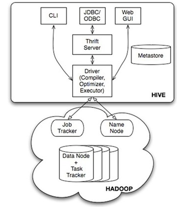
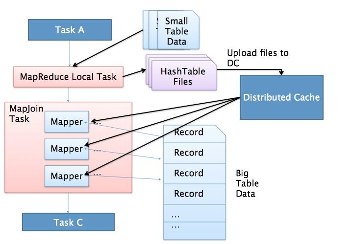
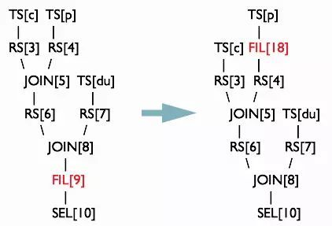

* [9.6、Hive](hive.md)
    - [1）、简述Hive主要结构？]()
    - [2）、Hive解析成MapReduce过程？]()
    - [3）、Hive与传统数据库的区别？]()
    - [4）、Hive内部表和外部表区别？]()
    - [5）、Hive中order by、sort by、distribute by和cluster by的区别？]()
    - [6）、Hive中row_number()、rank()和dense_rank()区别？]()
    - [7）、Hive中常用的系统函数有哪些？]()
    - [8）、Hive使用过udf函数么？如何使用的？]()
    - [9）、Hive如何实现分区？]()
    - [10）、Hive导入和导出数据的方式？]()
    - [11）、Hive窗口函数有哪些?]()
    - [12）、Hive中如何使用UDTF?]()
    - [13）、Hive表关联查询，如何解决数据倾斜问题？]()
    - [14）、Hive中数据的null在底层是如何存储的？]()
    - [15）、Hive有哪些方式保存元数据？各有哪些特点？]()
    - [16）、Hive中split、coalesce和collect_list函数的用法？]()
    - [17）、Hive在join时候大表和小表放置顺序？]()
    - [18）、Hive使用两张表关联，使用MapReduce怎么实现？]()
    - [19）、Hive中使用什么可以代替in查询？]()
    - [20）、所有的Hive任务底层都会执行MapReduce么？]()
    - [21）、Hive函数中UDF、UDAF和UDTF区别？]()
    - [22）、Hive桶表的理解？]()
    - [23）、Hive SQL语句是怎么执行的？]()
    - [24）、Hive用过哪些优化？]()
    - [25）、Hive如何设置并行数？]()
    - [26）、Hive如何合并小文件？]()
    - [27）、Hive动态分区？]()
    - [28）、Hive底层与数据库交互原理？]()
    - [29）、Hive的Fetch抓取？]()
    - [30）、Hive的Group By？]()
    - [31）、Hive的Count(Distinct) 去重统计？]()
    - [32）、Hive的笛卡尔积？]()
    - [33）、Hive的JVM重用？]()
    - [34）、Hive的行列过滤？]()
    - [35）、Hive的Map数？]()
    - [36）、Hive的Reduce数？]()
    - [37）、Hive的并行执行？]()
    - [38）、Hive的本地模式？]()
    - [39）、Hive的列裁剪和分区裁剪？]()
    - [40）、Hive的谓词下推?]()
    - [41）、Hive的严格模式?]()
    - [42）、Hive启用压缩?]()

---
###### [1）、简述Hive主要结构？]()
  
    
    1.用户接口主要有三个：CLI，Client 和 WUI。
    最常用的是CLI，Cli启动的时候，会同时启动一个Hive副本。
    Client是Hive的客户端，用户连接至Hive Server。在启动 Client模式的时候，需要指出Hive Server所在节点，并且在该节点启动Hive Server。 
    WUI是通过浏览器访问Hive。
    2.Hive将元数据存储在数据库中，如mysql、derby。Hive中的元数据包括表的名字，表的列和分区及其属性，表的属性（是否为外部表等），表的数据所在目录等。
    3.解释器、编译器、优化器完成HQL查询语句从词法分析、语法分析、编译、优化以及查询计划的生成。生成的查询计划存储在HDFS中，并在随后有MapReduce调用执行。
    4.Hive的数据存储在HDFS中，大部分的查询、计算由MapReduce完成（包含*的查询，比如select * from tbl不会生成MapRedcue任务）。

###### [2）、Hive解析成MapReduce过程？]()
    解释器、编译器、优化器完成HQL查询语句从词法分析、语法分析、编译、优化以及查询计划的生成。
    生成的查询计划存储在HDFS中，并在随后又MapReduce调用生成。
    
    hive sql 转换为 MapReduce过程:
    antlr 定义sql语法规则,完成sql词法,语法解析,将sql转换为抽象语法树AST tree
    遍历 AST tree,抽象出查询的基本单元 查询块queryBlock
    遍历 queryBlock,翻译成执行操作树 operatorTree
    逻辑层优化器进行OperatorTree优化,合并不需要的reduceSinkOperator(合并操作),减少shuffle(遍历清洗)数据量
    遍历operatorTree ,翻译成MapReduce任务
    物理层优化器进行MapReduce任务的转化,生成最终执行计划
    
    一个复杂的hive sql 可能会转化成 多个 MapReduce任务执行:
    HiveSql->AST tree(抽象语法树)->query block(查询块)->operation tree(执行操作树)->逻辑层优化执行操作树 减少重复的合并 减少不必要的shuffle(混洗)->
    new operation tree(新的执行逻辑树)->MapReduce task->进行物理层的优化->new MapReduce task

###### [3）、Hive与传统数据库的区别？]()
    查询语言不同,传统数据库用的是SQL语句,hive是集成的HQL语句.
    数据存储地方不同,不同于传统数据库存储在原始设备或本地文件系统(Raw Device or Local FS),Hive 存储在HDFS.
    执行方式不同,传统数据库是Excutor单元执行,hive是MapReduce
    同时hive执行延迟高,处理数据规模大,无索引(0.8版本后才加入位图索引,mysql有复杂的索引),都是hive与传统的区别. 

###### [4）、Hive内部表和外部表区别？]()
    1.未被external修饰的是内部表【managed table】，被external修饰的为外部表【external table】。
    2.内部表数据由Hive自身管理，外部表数据由HDFS管理。
    3.内部表数据存储在hive.metastore.warehouse.dir【默认:/user/hive/warehouse】，外部表数据存储位置由用户自己决定。
    4.删除内部表会直接删除元数据【metadata】及存储数据，删除外部表仅仅删除元数据，HDFS上的文件不会被删除。
    5.对内部表的修改会直接同步到元数据，而对外部表的表结构和分区进行修改，则需要修改【MSCK REPAIR TABLE table_name】。

###### [5）、Hive中order by、sort by、distribute by和cluster by的区别？]()
    order by 会对查询结果集执行一个全局排序，这也就是说所有的数据都通过一个reduce进行处理的过程，对于大数据集，这个过程将消耗很大的时间来执行。
    sort by 也就是执行一个局部排序过程。这可以保证每个reduce的输出数据都是有序的(但并非全局有效)。
    distribute by 控制 map的输出在reduer中是如何划分的,使用distribute by可以保证相同key的记录被划分到一个reducer中。
    cluster by 除了distribute by 的功能外，还会对该字段进行排序，所以cluster by = distribute by +sort by 。

###### [6）、Hive中row_number()、rank()和dense_rank()区别？]()
    row_number() over() : 排名函数，不会重复，适合于生成主键或者不并列排名
    rank() over() :  排名函数，有并列名次，名次不连续。如:1,1,3
    dense_rank() over() : 排名函数，有并列名次，名次连续。如：1，1，2

###### [7）、Hive中常用的系统函数有哪些？]()
    1、聚合函数：函数处理的数据粒度为多条记录。
    sum()—求和
    count()—求数据量
    avg()—求平均直
    distinct—求不同值数
    min—求最小值
    max—求最人值
    
    2、分析函数 Analytics functions
    RANK
    ROW_NUMBER
    DENSE_RANK
    CUME_DIST
    PERCENT_RANK
    
    3、字符串连接函数
    concat
    concat_ws
    collect_list
    collect_set

    eg：concat_ws(',',collect_set(concat（order_type,'(',order_number,')'）))
    
    4、其他函数
    cast -类型转换
    if判断 -- if(con,'','');

###### [8）、Hive使用过udf函数么？如何使用的？]()
      UDF：
      1、UDF函数可以直接应用于select语句，对查询结构做格式化处理后，再输出内容。
      2、编写UDF函数的时候需要注意一下几点：
        a）自定义UDF需要继承org.apache.hadoop.hive.ql.UDF。
        b）需要实现evaluate函数，evaluate函数支持重载。
      
      例：写一个返回字符串长度的Demo:
      import org.apache.hadoop.hive.ql.exec.UDF;
      public class GetLength extends UDF{
          public int evaluate(String str) {
              try{
                  return str.length();
              }catch(Exception e){
                  return -1;
              }
          }
      }
      3、步骤
        a）把程序打包放到目标机器上去；
        b）进入hive客户端，添加jar包：
            hive> add jar /root/hive_udf.jar
        c）创建临时函数：
            hive> create temporary function getLen as 'com.raphael.len.GetLength';
        d）查询HQL语句：
            hive> select getLen(info) from apachelog;
        e）销毁临时函数：
            hive> DROP TEMPORARY FUNCTION getLen;

###### [9）、Hive如何实现分区？]()
    Hive分区是指按照数据表的某一个字段或多个字段进行统一归类，并存储在在hdfs上的不同文件夹中。
    当查询过程中指定了分区条件时，只将该分区对应的目录作为Input，从而减少MapReduce的输入数据，提高查询效率。
    1、加载数据，使用指定字段作为分区字段，分区
    2、从已存在的分区目录创建分区

###### [10）、Hive导入和导出数据的方式？]()
    导入：
    1）、本地文件导入到Hive表；
    2）、Hive表导入到Hive表;
    3）、HDFS文件导入到Hive表;
    4）、创建表的过程中从其他表导入;
    5）、通过sqoop将mysql库导入到Hive表
    
    导出：
    1）、Hive表导出到本地文件系统；
    2）、Hive表导出到HDFS；
    3）、通过sqoop将Hive表导出到mysql库；

###### [11）、Hive窗口函数有哪些?]()
    聚合函数:
        sum：求和    
        count：计算总数 
        max：最大值
        min：最小值
        avg：平均值
    窗口函数:
        over（）：指定分析函数工作的窗口的大小。
        current row：当前行
        n preceding:往前n行数据
        n following:往后n行数据

###### [12）、Hive中如何使用UDTF?]()
    1、用户定义表生成函数（user-defined table-generating function，UDTF）。
    UDTF 操作作用于单个数据行，并且产生多个数据行，一个表作为输出。lateral view explore()。
    UDTF：返回拆分值，一对多
    
    2、编写自己需要的UDTF
    继承org.apache.hadoop.hive.ql.udf.generic.GenericUDTF。
    实现initialize, process, close三个方法
    UDTF首先会调用initialize方法，此方法返回UDTF的返回行的信息（返回个数，类型）。初始化完成后，会调用process方法，
    对传入的参数进行处理，可以通过forword()方法把结果返回。最后close()方法调用，对需要清理的方法进行清理。
    
    3、 使用方法
    UDTF有两种使用方法，一种直接放到select后面，一种和lateral view一起使用。
    1）、直接select中使用：select explode_map(properties) as (col1,col2) from src;
    # 不可以添加其他字段使用：select a, explode_map(properties) as (col1,col2) from src
    # 可以嵌套调用：select explode_map(explode_map(properties)) from src
    # 不可以和group by/cluster by/distribute by/sort by一起使用：
    #    select explode_map(properties) as (col1,col2) from src group by col1, col2

    2）、和lateral view一起使用：
    select src.id, mytable.col1, mytable.col2 from src lateral view explode_map(properties) mytable as col1, col2;

###### [13）、Hive表关联查询，如何解决数据倾斜问题？]()
    1） 过滤掉脏数据：如果大key是无意义的脏数据，直接过滤掉。
    2） 数据预处理：数据做一下预处理，尽量保证join的时候，同一个key对应的记录不要有太多。
    3） 增加reduce个数：如果数据中出现了多个大key，增加reduce个数，可以让这些大key落到同一个reduce的概率小很多。
    4） 转换为mapjoin：如果两个表join的时候，一个表为小表，可以用mapjoin做。
    5） 大key单独处理：将大key和其他key分开处理
    6） hive.optimize.skewjoin：会将一个join sql 分为两个job。另外可以同时设置下hive.skewjoin.key，默认为10000。
    7） 调整内存设置：适用于那些由于内存超限内务被kill掉的场景。
    如：set mapreduce.reduce.memory.mb=5120 ;
       set mapreduce.reduce.java.opts=-Xmx5000M -XX:MaxPermSize=128m ;
       
    倾斜原因：map输出数据按key Hash的分配到reduce中，由于key分布不均匀、业务数据本身的特、建表时考虑不周、等原因造成的reduce 上的数据量差异过大。
      （1）key分布不均匀;
      （2）业务数据本身的特性;
      （3）建表时考虑不周;
      （4）某些SQL语句本身就有数据倾斜;

###### [14）、Hive中数据的null在底层是如何存储的？]()
    null在hive底层默认是用'\N'来存储的。
    能够经过alter table test SET SERDEPROPERTIES('serialization.null.format' = 'a');来修改
    null与任何值运算的结果都是null, 可使用is null、is not null函数指定在其值为null状况下的取值。

###### [15）、Hive有哪些方式保存元数据？各有哪些特点？]()
    1）、内嵌模式（derby）：将元数据保存在本地内嵌的derby数据库中，内嵌的derby数据库每次只能访问一个数据文件，也就意味着它不支持多会话连接。
    2）、 本地模式：将元数据保存在本地独立的数据库中（一般是mysql），这可以支持多会话连接。
    3）、 远程模式：把元数据保存在远程独立的mysql数据库中，避免每个客户端都去安装mysql数据库，持久化好，查看方便。

###### [16）、Hive中split、coalesce和collect_list函数的用法？]()
    split将字符串转化为数组，即：split('a,b,c,d' , ',') ==> ["a","b","c","d"]。 
    coalesce(T v1, T v2, …) 返回参数中的第一个非空值；如果所有值都为 NULL，那么返回NULL。 
    collect_list列出该字段所有的值，不去重 => select collect_list(id) from table。 

###### [17）、Hive在join时候大表和小表放置顺序？]()
    在hive中，（启用Map join时） 大表left join小表，加载从右向左，所以小表会加载进内存，存储成map键值对，
    通过大表驱动小表，来进行join，即大表中的join字段作为key 来获取value进行join。

###### [18）、Hive使用两张表关联，使用MapReduce怎么实现？]()
    如果其中有一张表为小表，直接使用map端join的方式（map端加载小表）进行聚合。
    如果两张都是大表，那么采用联合key，联合key的第一个组成部分是join on中的公共字段，第二部分是一个flag，0代表表A，1代表表B
    由此让Reduce区分客户信息和订单信息；在Mapper中同时处理两张表的信息，将join on公共字段相同的数据划分到同一个分区中，
    进而传递到一个Reduce中，然后在Reduce中实现聚合。

###### [19）、Hive中使用什么可以代替in查询？]()
    Hive中的left semi join替换sql中的in操作

###### [20）、所有的Hive任务底层都会执行MapReduce么？]()
    不是，从Hive0.10.0版本开始，对于简单的不需要聚合的类似SELECT from
    LIMIT n语句，不需要起MapReduce job，直接通过Fetch task获取数据。

###### [21）、Hive函数中UDF、UDAF和UDTF区别？]()
    Hive中有三种UDF:
    1、用户定义函数(user-defined function)UDF
    2、用户定义聚集函数（user-defined aggregate function，UDAF）
    3、用户定义表生成函数（user-defined table-generating function，UDTF）。
      
    UDF操作作用于单个数据行，并且产生一个数据行作为输出。大多数函数都属于这一类（比如数学函数和字符串函数）。
    UDAF 接受多个输入数据行，并产生一个输出数据行。像COUNT和MAX这样的函数就是聚集函数。
    UDTF 操作作用于单个数据行，并且产生多个数据行，一个表作为输出。lateral view explore()。
      
    简单来说：
        UDF:返回对应值，一对一
        UDAF：返回聚类值，多对一
        UDTF：返回拆分值，一对多

###### [22）、Hive桶表的理解？]()
    桶表是对数据进行哈希取值，然后放到不同文件中存储。
    数据加载到桶表时，会对字段取hash值，然后与桶的数量取模。把数据放到对应的文件中。
    物理上，每个桶就是表(或分区）目录里的一个文件，一个作业产生的桶(输出文件)和reduce任务个数相同。
    桶表专门用于抽样查询，是很专业性的，不是日常用来存储数据的表，需要抽样查询时，才创建和使用桶表。

###### [23）、Hive SQL语句是怎么执行的？]()
    HiveSQL ->AST(抽象语法树) -> QB(查询块) ->OperatorTree（操作树）->优化后的操作树->mapreduce任务树->优化后的mapreduce任务树
    过程描述如下：
        SQL Parser：Antlr定义SQL的语法规则，完成SQL词法，语法解析，将SQL转化为抽象语法树AST Tree；
        Semantic Analyzer：遍历AST Tree，抽象出查询的基本组成单元QueryBlock；
        Logical plan：遍历QueryBlock，翻译为执行操作树OperatorTree；
        Logical plan optimizer: 逻辑层优化器进行OperatorTree变换，合并不必要的ReduceSinkOperator，减少shuffle数据量；
        Physical plan：遍历OperatorTree，翻译为MapReduce任务；
        Logical plan optimizer：物理层优化器进行MapReduce任务的变换，生成最终的执行计划。

###### [24）、Hive用过哪些优化？]()
    1、设置合理的map reduce的task数量
    2、小文件合并优化
    3、列裁剪与分区裁剪
    4、一般COUNT DISTINCT使用先GROUP BY再COUNT的方式替换COUNT(DISTINCT)
    5、用MapJoin把小表全部加载到内存在map端进行join，避免reducer处理
    6、left semi join替代in/exists操作

###### [25）、Hive如何设置并行数？]()
    set hive.exec.parallel=true 修改并行度

###### [26）、Hive如何合并小文件？]()
    在map执行前合并小文件，减少map数：CombineHiveInputFormat具有对小文件进行合并的功能（系统默认的格式）。
    HiveInputFormat没有对小文件合并功能。
    set hive.input.format= org.apache.hadoop.hive.ql.io.CombineHiveInputFormat;

###### [27）、Hive动态分区？]()
    hive中支持两种类型的分区：
    静态分区SP（static partition）
    动态分区DP（dynamic partition）
    静态分区与动态分区的主要区别在于静态分区是手动指定，而动态分区是通过数据来进行判断。
    静态分区的列实在编译时期，通过用户传递来决定的；动态分区只有在SQL执行时才能决定。
    
    实战演示如何在hive中使用动态分区：
    创建一张分区表，包含两个分区dt和ht表示日期和小时
    CREATE TABLE partition_table001 
    (
        name STRING,
        ip STRING
    )
    PARTITIONED BY (dt STRING, ht STRING)
    ROW FORMAT DELIMITED FIELDS TERMINATED BY "\t";
    
    启用hive动态分区，只需要在hive会话中设置两个参数：
    set hive.exec.dynamic.partition=true;
    set hive.exec.dynamic.partition.mode=nonstrict;

###### [28）、Hive底层与数据库交互原理？]()
    由于Hive的元数据可能要面临不断地更新、修改和读取操作，所以它显然不适合使用Hadoop文件系统进行存储。
    目前Hive将元数据存储在RDBMS中，比如存储在MySQL、Derby中。
    元数据信息包括：存在的表、表的列、权限和更多的其他信息。

###### [29）、Hive的Fetch抓取？]()
    Fetch抓取是指，Hive中对某些情况的查询可以不必使用MapReduce计算。
    例如：SELECT * FROM employees;在这种情况下，Hive可以简单地读取employee对应的存储目录下的文件，然后输出查询结果到控制台。
    在hive-default.xml.template文件中hive.fetch.task.conversion默认是more，老版本hive默认是minimal，
    该属性修改为more以后，在全局查找、字段查找、limit查找等都不走mapreduce。

###### [30）、Hive的Group By？]()
    默认情况下，Map阶段同一Key数据分发给一个reduce，当一个key数据过大时就倾斜了。
    并不是所有的聚合操作都需要在Reduce端完成，很多聚合操作都可以先在Map端进行部分聚合，最后在Reduce端得出最终结果。
    开启Map端聚合参数设置
    （1）是否在Map端进行聚合，默认为True
        hive.map.aggr = true
    （2）在Map端进行聚合操作的条目数目
        hive.groupby.mapaggr.checkinterval = 100000
    （3）有数据倾斜的时候进行负载均衡（默认是false）
        hive.groupby.skewindata = true
        当选项设定为 true，生成的查询计划会有两个MR Job。
        第一个MR Job中，Map的输出结果会随机分布到Reduce中，每个Reduce做部分聚合操作，并输出结果，这样处理的结果是相同的Group By Key有可能被分发到不同的Reduce中，从而达到负载均衡的目的；
        第二个MR Job再根据预处理的数据结果按照Group By Key分布到Reduce中,这个过程可以保证相同的Group By Key被分布到同一个Reduce中,最后完成最终的聚合操作。 

###### [31）、Hive的Count(Distinct) 去重统计？]()
    数据量小的时候无所谓，数据量大的情况下，由于COUNT DISTINCT操作需要用一个Reduce Task来完成，这一个Reduce需要处理的数据量太大，就会导致整个Job很难完成，
    一般COUNT DISTINCT使用先GROUP BY再COUNT的方式替换

###### [32）、Hive的笛卡尔积？]()
    尽量避免笛卡尔积，join的时候不加on条件，或者无效的on条件，Hive只能使用1个reducer来完成笛卡尔积

###### [33）、Hive的JVM重用？]()
    在MR job中，默认是每执行一个task就启动一个JVM。如果task非常小而碎，那么JVM启动和关闭的耗时就会很长。
    可以通过调节参数mapred.job.reuse.jvm.num.tasks来重用。
    例如将这个参数设成5，那么就代表同一个MR job中顺序执行的5个task可以重复使用一个JVM，减少启动和关闭的开销。但它对不同MR job中的task无效。

###### [34）、Hive的行列过滤？]()
    列处理：在SELECT中，只拿需要的列，如果有，尽量使用分区过滤，少用SELECT *。
    行处理：在分区剪裁中，当使用外关联时，如果将副表的过滤条件写在Where后面，那么就会先全表关联，之后再过滤。

###### [35）、Hive的Map数？]()
    mapper数量与输入文件的split数息息相关，在Hadoop源码org.apache.hadoop.mapreduce.lib.input.FileInputFormat类中可以看到split划分的具体逻辑。
    可以直接通过参数mapred.map.tasks（默认值2）来设定mapper数的期望值，但它不一定会生效
    设输入文件的总大小为total_input_size。HDFS中，一个块的大小由参数dfs.block.size指定，默认值64MB或128MB。
    在默认情况下，mapper数就是：
        default_mapper_num = total_input_size / dfs.block.size。
    参数mapred.min.split.size（默认值1B）和mapred.max.split.size（默认值64MB）分别用来指定split的最小和最大大小。
    split大小和split数计算规则是：
        split_size = MAX(mapred.min.split.size, MIN(mapred.max.split.size, dfs.block.size))
        split_num = total_input_size / split_size。
    得出mapper数：
        mapper_num = MIN(split_num, MAX(default_num, mapred.map.tasks))。
    
    如果想减少mapper数，就适当调高mapred.min.split.size，split数就减少了。
    如果想增大mapper数，除了降低mapred.min.split.size之外，也可以调高mapred.map.tasks。
    如果输入文件是少量大文件，就减少mapper数；如果输入文件是大量非小文件，就增大mapper数；至于大量小文件的情况，得考虑“合并小文件”

###### [36）、Hive的Reduce数？]()
    reducer数量的确定方法比mapper简单得多。使用参数mapred.reduce.tasks可以直接设定reducer数量，不像mapper一样是期望值。
    但如果不设这个参数的话，Hive就会自行推测，逻辑如下：
    参数hive.exec.reducers.bytes.per.reducer用来设定每个reducer能够处理的最大数据量，默认值1G（1.2版本之前）或256M（1.2版本之后）。
    参数hive.exec.reducers.max用来设定每个job的最大reducer数量，默认值999（1.2版本之前）或1009（1.2版本之后）。
    得出reducer数：reducer_num = MIN(total_input_size / reducers.bytes.per.reducer, reducers.max)。
    reducer数量与输出文件的数量相关。如果reducer数太多，会产生大量小文件，对HDFS造成压力。如果reducer数太少，每个reducer要处理很多数据，容易拖慢运行时间或者造成OOM。

###### [37）、Hive的并行执行？]()
    Hive中互相没有依赖关系的job间是可以并行执行的，最典型的就是多个子查询union all。
    在集群资源相对充足的情况下，可以开启并行执行，即将参数hive.exec.parallel设为true。
    另外hive.exec.parallel.thread.number可以设定并行执行的线程数，默认为8，一般都够用。

###### [38）、Hive的本地模式？]()
    Hive也可以不将任务提交到集群进行运算，而是直接在一台节点上处理。因为消除了提交到集群的overhead，所以比较适合数据量很小，且逻辑不复杂的任务。
    设置hive.exec.mode.local.auto为true可以开启本地模式。
    但任务的输入数据总量必须小于hive.exec.mode.local.auto.inputbytes.max（默认值128MB），且mapper数必须小于hive.exec.mode.local.auto.tasks.max（默认值4），
    reducer数必须为0或1，才会真正用本地模式执行。

###### [39）、Hive的列裁剪和分区裁剪？]()
    列裁剪就是在查询时只读取需要的列，分区裁剪就是只读取需要的分区。

###### [40）、Hive的谓词下推?]()
    将SQL语句中的where谓词逻辑都尽可能提前执行，减少下游处理的数据量。
    
    例如以下HiveSQL语句：
    select a.uid,a.event_type,b.topic_id,b.title
    from calendar_record_log a
    left outer join (
    select uid,topic_id,title from forum_topic
    where pt_date = 20190224 and length(content) >= 100
    ) b on a.uid = b.uid
    where a.pt_date = 20190224 and status = 0;

    对forum_topic做过滤的where语句写在子查询内部，而不是外部。
    Hive中有谓词下推优化的配置项hive.optimize.ppd，默认值true，与它对应的逻辑优化器是PredicatePushDown。
    该优化器就是将OperatorTree中的FilterOperator向上提

###### [41）、Hive的严格模式?]()
    所谓严格模式，就是强制不允许用户执行3种有风险的HiveSQL语句，一旦执行会直接失败。这3种语句是：
    1.查询分区表时不限定分区列的语句；
    2.两表join产生了笛卡尔积的语句；
    3.用order by来排序但没有指定limit的语句。

###### [42）、Hive启用压缩?]()
    压缩job的中间结果数据和输出数据，可以用少量CPU时间节省很多空间。压缩方式一般选择Snappy，效率最高。
    要启用中间压缩，需要设定hive.exec.compress.intermediate为true，同时指定压缩方式hive.intermediate.compression.codec为org.apache.hadoop.io.compress.SnappyCodec。
    另外，参数hive.intermediate.compression.type可以选择对块（BLOCK）还是记录（RECORD）压缩，BLOCK的压缩率比较高。
    输出压缩的配置基本相同，打开hive.exec.compress.output即可。

###### [43）、Hive新版本以及特性?]()

###### [44）、Hive列转行，行转列?，json解析？，窗口函数？]()

