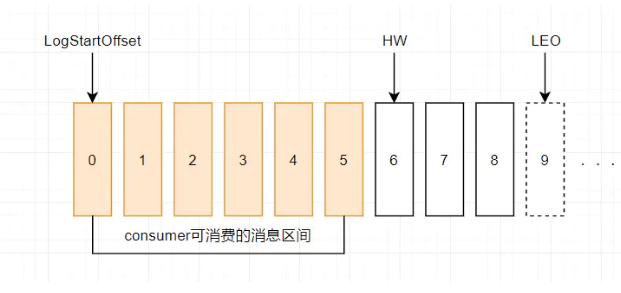
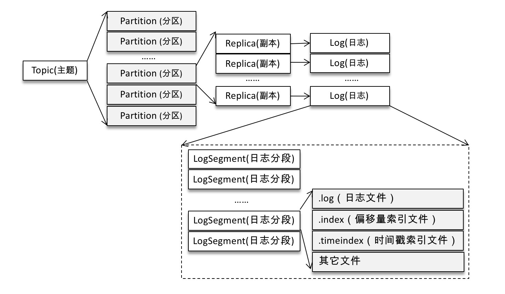

* [9.13、Kafka]()
    - [1）、Kafka如何保证消息的顺序？]()
    - [2）、Kafka的receiver和direct区别？]()
    - [3）、Kafka和Flink保证仅消费一次ExactlyOnce？]()
    - [4）、Kafka中ISR、AR表示什么？]()
    - [5）、Kafka中HW、LEO等表示什么意思？]()
    - [6）、Kafka中是怎么体现消息顺序性的？]()
    - [7）、Kafka中分区器、序列化器、拦截器是否了解？它们之间的顺序使什么？]()
    - [8）、Kafka生产者客户端整体结构式什么样子的？使用了几个线程处理？分别是什么？]()
    - [9）、Kafka消费组中的消费者个数如果超过了topic的分区，那么就会有消费者消费不到数据，这句话是否正确？]()
    - [10）、Kafka中消费者提交消费位移时提交的是当前消费到的最新消息offset还是offset+1？]()
    - [11）、Kafka中有哪些情形会造成重复消费？]()
    - [12）、Kafka中有哪些情形会造成消息漏消费？]()
    - [13）、当使用kafka-topics.sh创建(删除)一个topic之后，kafka背后会执行什么逻辑？]()
    - [14）、Kafka的topic分区数可不可以增加？如果可以怎么增加？如果不可以，那又是为什么？]()
    - [15）、Kafka的topic分区数可不可以减少？如果可以怎么增加？如果不可以，那又是为什么？]()
    - [16）、Kafka有内部的topic么？如果有是什么？有什么用？]()
    - [17）、Kafka分区分配的概念？]()
    - [18）、简述Kafka日志目录结构？]()
    - [19）、如果指定了一个offset，Kafka Controller怎么找到对应的消息？]()
    - [20）、Kafka Controller的作用？]()
    - [21）、Kafka中有哪些地方需要选举，这些地方的选举策略有哪些？]()
    - [22）、Kafka失效副本是指什么？有哪些应对策略？]()
    - [23）、Kafka的哪些设计让它有如此高的性能？]()
    - [24）、简述Kafka的基础架构？]()
    - [25）、Kafka的用途有哪些？适用于哪些使用场景？]()
    - [26）、Kafka中过期数据清理？]()
    - [27）、Kafka中幂等是怎么实现的？]()
    - [28）、Kafka中优先副本是什么？有什么特殊的作用？]()
    - [29）、Kafka中zookeeper作用是什么？]()
    - [30）、Kafka的ACK机制？]()
    - [31）、Kafka如何实现ExactlyOnce？]()
    - [32）、说说Kafka的使用场景？]()
    - [33）、Kafka与传统MQ消息系统之间有三个关键区别？]()
    - [34）、kafka如何保证不丢失消息？]()
    - [35）、Kafka分区的目的？]()
    - [36）、Kafka消息是采用Pull模式，还是Push模式？]()
    - [37）、Kafka 数据存储类型？]()

---
###### [1）、Kafka如何保证消息的顺序？]()
    在Kafka中，只保证Partition(分区)内有序，不保证Topic所有分区都是有序的。
    全局有序：一个Topic下的所有消息都需要按照生产顺序消费。
    局部有序：一个Topic下的消息，只需要满足同一业务字段的要按照生产顺序消费。例如：Topic消息是订单的流水表，包含订单orderId，业务要求同一个orderId的消息需要按照生产顺序进行消费。

    kafka的幂等可以保证单分区有序消费。
    所以 Kafka 要保证消息的消费顺序，可以有2种方法：
    一、1个Topic（主题）只创建1个Partition(分区)，这样生产者的所有数据都发送到了一个Partition(分区)，保证了消息的消费顺序。
    二、生产者在发送消息的时候指定要发送到哪个Partition(分区)。
        我们需要将 producer 发送的数据封装成一个 ProducerRecord 对象。
        （1）指明 partition 的情况下，直接将指明的值直接作为 partiton 值；
        （2）没有指明partition值但有key的情况下，将key的hash值与topic的partition数进行取余得到partition值；
        （3）既没有 partition 值又没有 key 值的情况下，第一次调用时随机生成一个整数（后面每次调用在这个整数上自增），
            将这个值与topic可用的partition总数取余得到partition值，也就是常说的round-robin算法。

###### [2）、Kafka的receiver和direct区别？]()
    1).基于Receiver的方式: 
    这种方式使用Receiver来获取数据。Receiver是使用Kafka的高层次Consumer API来实现的。
    receiver从Kafka中获取的数据都是存储在Spark Executor的内存中的，然后Spark Streaming启动的job回去处理那些数据。
    2).基于Direct的方式
    在Spark1.3中引入的，能够确保更加健壮的机制。替代掉使用Receiver来接收数据后，这种方式会周期性地查询Kafka，来获得每个topic+partition的最新的offset，从而定义每个batch的offset的范围。
    当处理数据的job启动时，就会使用Kafka的简单consumer api来获取Kafka指定offset范围的数据

###### [3）、Kafka和Flink保证仅消费一次ExactlyOnce？]()
    flink通过checkpoint保证了flink应用内部的exactly-once语义，通过TwoPhaseCommitSinkFunction可以保证端到端的exactly-once语义。
    
    要求source和sink的外部系统都必须是支持分布式事务的，能够支持回滚和提交。然而一个简单的提交和回滚，对于一个分布式的流式数据处理系统来说是远远不够的。
    flink使用两阶段提交协议:
        1、预提交。预提交是所有的算子全部完成checkpoint，并JM会向所有算子发通知说这次checkpoint完成。
        2、正式提交。flink负责向kafka写入数据的算子也会正式提交之前写操作的数据。在任务运行中的任何阶段失败，都会从上一次的状态恢复，所有没有正式提交的数据也会回滚。

###### [4）、Kafka中ISR、AR表示什么？]()
    AR = ISR + OSR。
    分区中的所有副本统称为 AR (Assigned Replicas)。
    所有与leader副本保持一定程度同步的副本（包括leader副本在内）组成 ISR (In Sync Replicas)。
    ISR 集合是 AR 集合的一个子集。消息会先发送到leader副本，然后follower副本才能从leader中拉取消息进行同步。
    同步期间，follow副本相对于leader副本而言会有一定程度的滞后。leader副本同步滞后过多的副本（不包括leader副本）将组成OSR （Out-of-Sync Replied）。
    由此可见，AR = ISR + OSR。正常情况下，所有的follower副本都应该与leader 副本保持 一定程度的同步，即AR=ISR，OSR集合为空。

###### [5）、Kafka中HW、LEO等表示什么意思？]()
    HW （High Watermark）俗称高水位，它标识了一个特定的消息偏移量（offset），消费者只能拉取到这个offset之前的消息。
    如下图表示一个日志文件，这个日志文件中只有9条消息，第一条消息的offset（LogStartOffset）为0，最有一条消息的offset为8，offset为9的消息使用虚线表示的，代表下一条待写入的消息。
    日志文件的 HW 为6，表示消费者只能拉取offset在 0 到 5 之间的消息，offset为6的消息对消费者而言是不可见的。

    LEO （Log End Offset），标识当前日志文件中下一条待写入的消息的offset。上图中offset为9的位置即为当前日志文件的 LEO，LEO 的大小相当于当前日志分区中最后一条消息的offset值加1。
    分区 ISR 集合中的每个副本都会维护自身的 LEO ，而 ISR 集合中最小的 LEO 即为分区的 HW，对消费者而言只能消费 HW 之前的消息。

###### [6）、Kafka中是怎么体现消息顺序性的？]()
    kafka每个partition中的消息在写入时都是有序的，消费时，每个partition只能被每一个group中的一个消费者消费，保证了消费时也是有序的。
    整个topic不保证有序。如果为了保证topic整个有序，那么将partition调整为1.

###### [7）、Kafka中分区器、序列化器、拦截器是否了解？它们之间的顺序使什么？]()
    拦截器->序列化器->分区器

###### [8）、Kafka生产者客户端整体结构式什么样子的？使用了几个线程处理？分别是什么？]()
    2个，主线程和Sender线程。主线程负责创建消息，然后通过分区器、序列化器、拦截器作用之后缓存到累加器RecordAccumulator中。
    Sender线程负责将RecordAccumulator中消息发送到kafka中.

###### [9）、Kafka消费组中的消费者个数如果超过了topic的分区，那么就会有消费者消费不到数据，这句话是否正确？]()
    不正确，通过自定义分区分配策略，可以将一个consumer指定消费所有partition。

###### [10）、Kafka中消费者提交消费位移时提交的是当前消费到的最新消息offset还是offset+1？]()
    offset+1

###### [11）、Kafka中有哪些情形会造成重复消费？]()
    消费者消费后没有commit offset(程序崩溃/强行kill/消费耗时/自动提交偏移情况下unscrible)

###### [12）、Kafka中有哪些情形会造成消息漏消费？]()
    消费者没有处理完消息 提交offset(自动提交偏移 未处理情况下程序异常结束)

###### [13）、当使用kafka-topics.sh创建(删除)一个topic之后，kafka背后会执行什么逻辑？]()
    创建:在zk上/brokers/topics/下节点 kafkabroker会监听节点变化创建主题
    删除:调用脚本删除topic会在zk上将topic设置待删除标志，kafka后台有定时的线程会扫描所有需要删除的topic进行删除

###### [14）、Kafka的topic分区数可不可以增加？如果可以怎么增加？如果不可以，那又是为什么？]()
    可以

###### [15）、Kafka的topic分区数可不可以减少？如果可以怎么增加？如果不可以，那又是为什么？]()
    不可以，因为顺序性问题、事务性问题、以及分区和副本的状态机切换问题都是不得不面对的。

###### [16）、Kafka有内部的topic么？如果有是什么？有什么用？]()
    __consumer_offsets：作用是保存 Kafka 消费者的位移信息
    __transaction_state：用来存储事务日志消息

###### [17）、Kafka分区分配的概念？]()

###### [18）、简述Kafka日志目录结构？]()
    每个partition一个文件夹，包含四类文件 (.index  .log  .timeindex   leader-epoch-checkpoint)
    .index .log .timeindex 三个文件成对出现 前缀为上一个segment的最后一个消息的偏移 
    log文件中保存了所有的消息
    index文件中保存了稀疏的相对偏移的索引
    timeindex保存的则是时间索引
    leader-epoch-checkpoint中保存了每一任leader开始写入消息时的offset 会定时更新,follower被选为leader时会根据这个确定哪些消息可用

###### [19）、如果指定了一个offset，Kafka Controller怎么找到对应的消息？]()
    1.通过文件名前缀数字x找到该绝对offset 对应消息所在文件
    2.offset-x为在文件中的相对偏移
    3.通过index文件中记录的索引找到最近的消息的位置
    4.从最近位置开始逐条寻找

###### [20）、Kafka Controller的作用？]()
    控制器组件（Controller），是 Apache Kafka 的核心组件。它的主要作用是在 Apache ZooKeeper 的帮助下管理和协调整个 Kafka 集群。
    集群中任意一台 Broker 都能充当控制器的角色，但是，在运行过程中，只能有一个 Broker 成为控制器，行使其管理和协调的职责。

###### [21）、Kafka中有哪些地方需要选举，这些地方的选举策略有哪些？]()
    partition leader（ISR），controller（先到先得）

###### [22）、Kafka失效副本是指什么？有哪些应对策略？]()
    不能及时与leader同步，暂时踢出ISR，等其追上leader之后再重新加入

###### [23）、Kafka的哪些设计让它有如此高的性能？]()
    分区，顺序写磁盘，0-copy
    
    Kafka零拷贝：
    传统的文件传输有多次用户态和内核态之间的切换，而且文件在多个buffer之间要复制多次最终才被发送到网卡。
    DMA是一种硬件直接访问系统主内存的技术。
    多种硬件都已使用了DMA技术，其中就包括网卡（NIC）。
    DMA技术让CPU得到解放，让CPU可以不用一直守着来完成文件传输。
    零拷贝技术减少了用户态与内核态之间的切换，让拷贝次数降到最低，从而实现高性能。
    Kafka使用零拷贝技术来进行文件的传输。

###### [24）、简述Kafka的基础架构？]()
    Kafka 架构分为以下几个部分
    Producer ：消息生产者，就是向 kafka broker 发消息的客户端。
    Consumer ：消息消费者，向 kafka broker 取消息的客户端。
    Topic ：可以理解为一个队列，一个 Topic 又分为一个或多个分区，
    Consumer Group：这是 kafka 用来实现一个 topic 消息的广播（发给所有的 consumer）和单播（发给任意一个 consumer）的手段。一个 topic 可以有多个 Consumer Group。
    Broker ：一台 kafka 服务器就是一个 broker。一个集群由多个 broker 组成。一个 broker 可以容纳多个 topic。
    Partition：为了实现扩展性，一个非常大的 topic 可以分布到多个 broker上，每个 partition 是一个有序的队列。partition 中的每条消息都会被分配一个有序的id（offset）。将消息发给 consumer，kafka 只保证按一个 partition 中的消息的顺序，不保证一个 topic 的整体（多个 partition 间）的顺序。
    Offset：kafka 的存储文件都是按照 offset.kafka 来命名，用 offset 做名字的好处是方便查找。例如你想找位于 2049 的位置，只要找到 2048.kafka 的文件即可。当然 the first offset 就是 00000000000.kafka。

###### [25）、Kafka的用途有哪些？适用于哪些使用场景？]()
    消息系统： Kafka 和传统的消息系统（也称作消息中间件）都具备系统解耦、冗余存储、流量削峰、缓冲、异步通信、扩展性、可恢复性等功能。Kafka 还提供了大多数消息系统难以实现的消息顺序性保障及回溯消费的功能。
    存储系统： Kafka 把消息持久化到磁盘，相比于其他基于内存存储的系统而言，有效地降低了数据丢失的风险。也正是得益于 Kafka 的消息持久化功能和多副本机制，我们可以把 Kafka 作为长期的数据存储系统来使用，只需要把对应的数据保留策略设置为“永久”或启用主题的日志压缩功能即可。
    流式处理平台： Kafka 不仅为每个流行的流式处理框架提供了可靠的数据来源，还提供了一个完整的流式处理类库，比如窗口、连接、变换和聚合等各类操作。
    
###### [26）、Kafka中过期数据清理？]()
    Kafka将数据持久化到了硬盘上，允许你配置一定的策略对数据清理，清理的策略有两个，删除和压缩。
    删除:直接删除，删除后的消息不可恢复。
    压缩:将数据压缩，只保留每个key最后一个版本的数据。

###### [27）、Kafka中幂等是怎么实现的？]()
    为了实现生产者的幂等性，Kafka 为此引入了 producer id（以下简称 PID）和序列号（sequence number）这两个概念。
    每个新的生产者实例在初始化的时候都会被分配一个 PID，这个 PID 对用户而言是完全透明的。对于每个 PID，消息发送到的每一个分区都有对应的序列号，这些序列号从0开始单调递增。生产者每发送一条消息就会将 对应的序列号的值加1。
    broker 端会在内存中为每一对 维护一个序列号。对于收到的每一条消息，只有当它的序列号的值（SN_new）比 broker 端中维护的对应的序列号的值（SN_old）大1（即 SN_new = SN_old + 1）时，broker 才会接收它。
    如果 SN_new< SN_old + 1，那么说明消息被重复写入，broker 可以直接将其丢弃。如果 SN_new> SN_old + 1，那么说明中间有数据尚未写入，出现了乱序，暗示可能有消息丢失，对应的生产者会抛出 OutOfOrderSequenceException，这个异常是一个严重的异常，后续的诸如 send()、beginTransaction()、commitTransaction() 等方法的调用都会抛出 IllegalStateException 的异常。

###### [28）、Kafka中优先副本是什么？有什么特殊的作用？]()
    所谓的优先副本是指在AR集合列表中的第一个副本。
    理想情况下，优先副本就是该分区的leader 副本，所以也可以称之为 preferred leader。Kafka 要确保所有主题的优先副本在 Kafka 集群中均匀分布，这样就保证了所有分区的 leader 均衡分布。以此来促进集群的负载均衡，这一行为也可以称为“分区平衡”。

###### [29）、Kafka中zookeeper作用是什么？]()
    1、Broker注册:
    Broker是分布式部署并且相互之间相互独立，但是需要有一个注册系统能够将整个集群中的Broker管理起来，此时就使用到了Zookeeper。在Zookeeper上会有一个专门用来进行Broker服务器列表记录的节点：/brokers/ids
    2、Topic注册
    在Kafka中，同一个Topic的消息会被分成多个分区并将其分布在多个Broker上，这些分区信息及与Broker的对应关系也都是由Zookeeper在维护，由专门的节点来记录，如：/borkers/topics
    3、生产者负载均衡
    由于同一个Topic消息会被分区并将其分布在多个Broker上，因此，生产者需要将消息合理地发送到这些分布式的Broker上，那么如何实现生产者的负载均衡，Kafka支持传统的四层负载均衡，也支持Zookeeper方式实现负载均衡。
    4、分区 与 消费者 的关系:
    在Kafka中，规定了每个消息分区 只能被同组的一个消费者进行消费，因此，需要在 Zookeeper 上记录 消息分区 与 Consumer 之间的关系
    5.消费进度Offset 记录:
    在消费者对指定消息分区进行消息消费的过程中，需要定时地将分区消息的消费进度Offset记录到Zookeeper上,
    Offset在Zookeeper中由一个专门节点进行记录，其节点路径为:
    /consumers/[group_id]/offsets/[topic]/[broker_id-partition_id]
    6、消费者注册:
    注册到消费者分组。每个消费者服务器启动时，都会到Zookeeper的指定节点下创建一个属于自己的消费者节点，例如/consumers/[group_id]/ids/[consumer_id]

###### [30）、Kafka的ACK机制？]()
    ack机制，即producer发送消息的确认机制，会影响到kafka的消息吞吐量和安全可靠性，二者不可兼得，只能平均；
    ack的取值有三个1、0、-1
    ack=0，producer只发送一次消息，无论consumer是否收到；
    ack=-1，producer发送的消息，只有收到分区内所有副本都成功写入的通知后才认为发动成功；
    ack=1，producer发送的消息只有leader接收成功后才认为消息发送成功，无论leader是否成功将消息同步到follower，所以，ack值为1 也不一定是安全的。

###### [31）、Kafka如何实现ExactlyOnce？]()
    在0.11.x版本之前，Apache Kafka支持at-least-once delivery语义以及partition内部的顺序delivery，某些场景下可能会导致数据重复消费。而Kafka 0.11.x支持exactly-once语义，其中主要包括三个内部逻辑的改造：
    1.幂等：partition内部的exactly-once顺序语义
    幂等操作，是指可以执行多次，而不会产生与仅执行一次不同结果的操作，Producer的send操作现在是幂等的。
    发送到Kafka的每批消息将包含一个序列号，该序列号用于重复数据的删除。与TCP不同，TCP只能在transient in-memory中提供保证。序列号将被持久化存储topic中，因此即使leader replica失败，接管的任何其他broker也将能感知到消息是否重复。
    这种机制的开销相当低：它只是在每批消息中添加了几个额外字段:
    PID，在Producer初始化时分配，作为每个Producer会话的唯一标识；
    序列号（sequence number），Producer发送的每条消息（更准确地说是每一个消息批次，即ProducerBatch）都会带有此序列号，从0开始单调递增。Broker根据它来判断写入的消息是否可接受。
    2.跨partition的原子性写操作
    Kafka现在支持使用新事务API原子性的对跨partition进行写操作，该API允许producer发送批量消息到多个partition。该功能同样支持在同一个事务中提交消费者offsets，因此真正意义上实现了end-to-end的exactly-once delivery语义。
    3.Exactly-once 流处理
    基于幂等和原子性，通过Streams API实现exactly-once流处理成为可能。

###### [32）、说说Kafka的使用场景？]()
    异步处理:将一些实时性要求不是很强的业务异步处理，起到缓冲的作用，一定程度上也会避免因为有些消费者处理的太慢或者网络问题导致的通讯等待太久，因而导致的单个服务崩溃
    应用解耦:消息队列将消息生产者和消费者分离开来，可以实现应用解耦
    流量削峰:可以通过在应用前端采用消息队列来接收请求，可以达到削峰的目的：请求超过队列长度直接不处理，重定向至错误页面。类似于网关限流的作用
    冗余存储:消息队列把数据进行持久化，直到它们已经被完全处理，通过这一方式规避了数据丢失风险
    消息通讯:可以作为基本的消息通讯，比如聊天室等工具的使用

###### [33）、Kafka与传统MQ消息系统之间有三个关键区别？]()
    Kafka持久化日志，这些日志可以被重复读取和无限期保留
    Kafka是一个分布式系统：它以集群的方式运行，可以灵活伸缩，在内部通过复制数据提升容错能力和高可用性
    Kafka支持实时的流式处理

###### [34）、kafka如何保证不丢失消息？]()
    1.复制因子：创建topic的时候指定复制因子大于1时，一个分区被分配到一个broker上，同时会在其他broker上维护一个分区副本；
    2.isr列表：分区及其副本分别为leader和follower，leader对外提供读写服务，follower会向leader发送同步请求，拉取最新的数据，如果follower和leader的消息差距保持在一定范围之内，那么这个follower在isr列表内；当分区leader所在broker宕机，会从isr列表中选举一个follower作为新的leader提供服务
    3.通过kafka的acks参数可以控制消息的发送行为，acks可选的值有0、1、all；当设置为0时，生产者消息发送成功即为成功，不关心是否写入到磁盘及后续操作；当设置为1时，消息发送到分区leader后写入磁盘即为成功；当设置为all时，消息发送到分区leader并写入磁盘后，同步给isr列表中的所有分区副本后即为成功

###### [35）、Kafka 分区的目的？]()
    分区对于 Kafka 集群的好处是：实现负载均衡。分区对于消费者来说，可以提高并发度，提高效率。

###### [36）、Kafka消息是采用Pull模式，还是Push模式？]()
    Pull模式的一个好处是consumer可以自主决定是否批量的从broker拉取数据。consumer就可以根据自己的消费能力去决定这些策略。
    Pull有个缺点是，如果broker没有可供消费的消息，将导致consumer不断在循环中轮询，直到新消息到达。为了避免这点，Kafka有个参数可以让consumer阻塞知道新消息到达.

###### [37）、Kafka 数据存储类型？]()

###### [38）、Kafka 选举策略？]()

