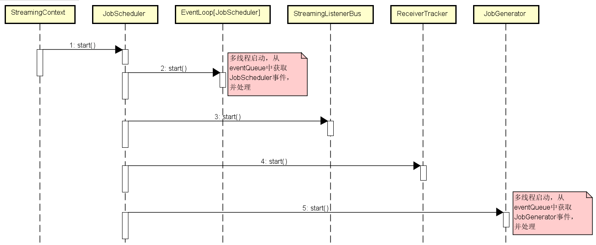
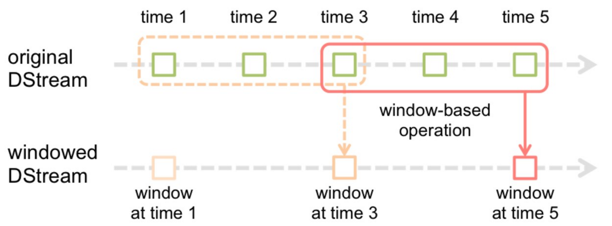

* [9.3、Spark Streaming](sparkstreaming.md)
    - [1）、Spark Streaming如何保证数据仅且消费一次？]()
    - [2）、Spark Streaming中DataFrame和DataSet区别？]()
    - [3）、Spark Streaming如何做checkPoint检查点？]()
    - [4）、Spark Streaming如何设置batch大小？]()
    - [5）、Spark Streaming程序消费过慢如何解决？]()
    - [6）、统计实时流中某一单词出现的总个数（eg：比如一天某商品被点击的PV）？]()
    - [7）、Spark Streaming工作流程是怎样的？和Storm以及Flink有什么区别？]()
    - [8）、Spark Streaming输出小文件问题？]()
    - [9）、Spark Streaming中foreachRDD如何使用？]()
    - [10）、Spark Streaming的启动时序图？]()
    - [11）、Spark Streaming程序调优？]()
    - [12）、Spark Streaming窗口大小？每个窗口处理的数据量？]()
    - [13）、Spark Streaming中updateStateByKey和mapWithState的区别与使用？]()
    - [14）、Spark Streaming面对高峰数据如何处理？]()
    - [15）、Spark Streaming反压机制？]()
    - [16）、Spark Streaming如何实现ExactlyOnce？]()

---
###### [1）、Spark Streaming如何保证数据仅且消费一次？]()
    定期做checkpoint，保存上游消息队列的offset位置信息。

###### [2）、Spark Streaming中DataFrame和DataSet区别？]()
    RDD是分布式的 Java对象的集合。DataFrame是分布式的Row对象的集合，Dataset每一个record存储的是一个强类型值而不是一个Row。
    
    spark 新特性主要增加DataFrame/DataSet、Structured Streaming和Spark Session
    1. DataFrame/DataSet主要替换之前的RDD，主要优势在执行效率、集群间通信、执行优化和GC开销比RDD有优势。
    2. Structured Streaming大部分场景替换之前的Streaming，比之前的优势集中中简洁的模型、一致的API、卓越的性能和Event Time的支持
    3. SparkSession的概念，它为用户提供了一个统一的切入点来使用Spark的各项功能，SparkConf、SparkContext和SQLContext都已经被封装在SparkSession当中。

###### [3）、Spark Streaming如何做checkPoint检查点？]()
    Spark Streaming的检查点具有容错机制,支持两种数据类型的检查点：元数据检查点和数据检查点。
    在Spark中checkpoint主要通过CheckpointRDD和RDDCheckpointData实现的。
    
    CheckpointRDD:用来从存储中恢复检查点的RDD。
    RDDCheckpointData:用于保存与检查点相关的信息，每个RDDCheckpointData实例都与一个RDD实例相关。

###### [4）、Spark Streaming如何设置batch大小？]()
    设置sparkstreaming批处理的时间间隔:val ssc = new StreamingContext(conf, Seconds(5))
    每个Batch Duration时间去提交一次job，如果job的处理时间超过Batch Duration，会使得job无法按时提交。
    随着时间推移，越来越多的作业被拖延，最后导致整个Streaming作业被阻塞，无法做到实时处理数据。

###### [5）、Spark Streaming程序消费过慢如何解决？]()
    1、优化代码逻辑、合理设置batch时间
    2、合理增加数据处理和接收时的并行度
    3,内存优化,是否内存常驻大对象
    4,有必要可以使用广播变量

###### [6）、统计实时流中某一单词出现的总个数（eg：比如一天某商品被点击的PV）？]()

###### [7）、Spark Streaming工作流程是怎样的？和Storm以及Flink有什么区别？]()
    Spark Streaming是核心Spark API的扩展，可实现实时数据流的可伸缩，高吞吐量，容错流处理。数据可以从像Kafka，Flume，Kinesis，或TCP sockets许多来源摄入，
    并且可以使用与像高级别功能表达复杂的算法来处理map，reduce，join和window。最后，可以将处理后的数据推送到文件系统，数据库和实时仪表板。
    实际上，可以在数据流上应用Spark的机器学习和图形处理算法。
    Spark Streaming提供了称为离散流或DStream的高级抽象，它表示连续的数据流。
    可以根据来自Kafka，Flume和Kinesis等来源的输入数据流来创建DStream，也可以通过对其他DStream应用高级操作来创建DStream。在内部，DStream表示为RDD序列。
    
    模型：Storm 和 Flink 是真正的一条一条处理数据；Spark Streaming 其实都是小批处理，一次处理一批数据（小批量）。
    API：Storm 使用基础 API 进行开发，比如实现一个简单的 sum 求和操作；而 Spark Streaming 和 Flink 中都提供封装后的高阶函数，可以直接拿来使用
    保证次数：在数据处理方面，Storm 可以实现至少处理一次，但不能保证仅处理一次，这样就会导致数据重复处理问题，Spark Streaming和Flink可以保证对数据实现仅一次的处理
    容错机制：Storm通过ACK机制实现数据的容错机制，而Spark Streaming和 Flink 可以通过 CheckPoint 机制实现容错机制。
    状态管理：Storm 中没有实现状态管理，Spark Streaming 实现了基于 DStream 的状态管理，而 Flink 实现了基于操作的状态管理。
    延时：表示数据处理的延时情况， 因此 Storm 和 Flink 接收到一条数据就处理一条数据，其数据处理的延时性是很低的；Spark Streaming 都是小型批处理，它们数据处理的延时性相对会偏高。
    吞吐量：Storm 的吞吐量其实也不低，只是相对于其他几个框架而言较低；而 Spark Streaming 和 Flink 的吞吐量是比较高的。
    
    综上，主要是因为Flink的高吞吐、低延迟、高性能等特性优于其它同类产品，使得越来越多的公司更青睐它。

###### [8）、Spark Streaming输出小文件问题？]()
    原因是sparkstreaming的微批处理模式和DStream(RDD)的分布式(partition)特性导致的。
    sparkstreaming为每个partition启动一个独立的线程来处理数据，一旦文件输出到HDFS，那么这个文件流就关闭了，
    再来一个batch的parttition任务，就再使用一个新的文件流。
    假设，一个batch为10s，每个输出的DStream有32个partition，那么一个小时产生的文件数将会达到(3600/10)*32=11520个之多。
    1、增加batch大小
    2、输出之前重分区
    3、定时批处理任务合并
    4、foreach的append方法追加

###### [9）、Spark Streaming中foreachRDD如何使用？]()
    dstream.foreachRDD是一个功能强大的原语primitive，它允许将数据发送到外部系统。
    输出操作实际上是允许外部系统消费转换后的数据，它们触发的实际操作是DStream转换。

###### [10）、Spark Streaming的启动时序图？]()
  

###### [11）、Spark Streaming程序调优？]()
    01合理的批处理时间（batchDuration）
    02合理的Kafka拉取量（maxRatePerPartition参数设置）
    03缓存反复使用的Dstream（RDD）
    04其他一些优化策略
        设置合理的GC方式
        设置合理的parallelism
        设置合理的CPU资源数
        高性能的算子
        Kryo优化序列化性能

###### [12）、Spark Streaming窗口大小？每个窗口处理的数据量？]()
    在Spark Streaming中，数据处理是按批进行的，而数据采集是逐条进行的，因此在Spark Streaming中会先设置好批处理间隔（batch duration），当超过批处理间隔的时候就会把采集到的数据汇总起来成为一批数据交给系统去处理。
    对于窗口操作而言，在其窗口内部会有N个批处理数据，批处理数据的大小由窗口间隔（window duration）决定，而窗口间隔指的就是窗口的持续时间，在窗口操作中，只有窗口的长度满足了才会触发批数据的处理。
    除了窗口的长度，窗口操作还有另一个重要的参数就是滑动间隔（slide duration），它指的是经过多长时间窗口滑动一次形成新的窗口，滑动窗口默认情况下和批次间隔的相同，
    而窗口间隔一般设置的要比它们两个大。在这里必须注意的一点是滑动间隔和窗口间隔的大小一定得设置为批处理间隔的整数倍
 
 
    如上图所示，批处理间隔是1个时间单位，窗口间隔是3个时间单位，滑动间隔是2个时间单位。
    对于窗口操作，批处理间隔、窗口间隔和滑动间隔是非常重要的三个时间概念，是理解窗口操作的关键所在。
    val windowedWordCounts = pairs.reduceByKeyAndWindow((a:Int,b:Int) => (a + b), Seconds(30), Seconds(10))

###### [13）、Spark Streaming中updateStateByKey和mapWithState的区别与使用？]()
    Spark Streaming 中状态管理函数包括updateStateBykey和mpaWithState，都是用来统计全局key的状态的变化的。
    以DStream中的数据进行按key做reduce操作，然后对各个批次的数据进行累加，在有新的数据信息进入或更新时。
    
    1.UpdateStateByKey（基于磁盘读写）
    UpdateStateBykey会统计全局的key的状态，不管有没有数据输入，它会在每一个批次间隔返回之前的key的状态。
    updateStateBykey会对已存在的key进行state的状态更新，同时还会对每个新出现的key执行相同的更新函数操作。
    如果通过更新函数对state更新后返回来为none，此时刻key对应的state状态会删除（state可以是任意类型的数据结构）。
    
    适用场景：
    UpdataStateBykey可以用来统计历史数据，每次输出所有的key值。列如统计不同时间段用户平均消费金额，消费次数，消费总额，网站的不同时间段的返回量等指标。
    适用实例:
    首先会以DStream中的数据进行按key做reduce操作，然后再对各个批次的数据进行累加。
    updataStateByKey要求必须设置checkpoint点（设置中间结果文件夹）
    updataStateByKey方法中updataFunc就要传入的参数，Seq[V]表示当前key对应的所有值，Option[S]是当前key的历史状态，返回的是新的封装的数据。
    
    2.mapWithState（基于磁盘存储+缓存）
    mapWithState也是用于对于全局统计key的状态，但是它如果没有数据输入，便不会返回之前的key的状态，类型于增量的感觉。
    
    适用场景:
    mapWithState可以用于一些实时性较高，延迟较少的一些场景，例如你在某宝上下单买了个东西，付款之后返回你账户里余额信息。
    适用实例:
    mapWithState如果有初始化的值的需要，可以使用initialState(RDD)来初始化key的值
    mapWithState指定timeout函数，如果一个key超过timeout设定的时间没有更新值，那么这个key将会失效。这个控制需要在fun中实现，必须使用state.isTimingOut()来判断失效的key值。如果在失效时间之后，这个key又有新的值了，则会重新计算。如果没有使用isTimingOut，则会报错。
    mapWithState对于checkpoint是不必须的
    
    区别:
    updataeStateByKey可以在指定的批次间隔内返回之前的全部历史数据，包括新增的，改变的和没有改变的。由于updateStateByKey在使用的时候一定要做checkpoint，当数据量过大的时候，checkpoint会占据庞大的数据量，会影响性能，效率不高。
    mapWithState只返回变化后的key的值，可以只关心那些已经发生的变化的key，对于没有数据输入，则不会返回那些没有变化的key 的数据。这样的话，即使数据量很大，checkpint也不会updateBykey那样，占用太多的存储，效率比较高

###### [14）、Spark Streaming面对高峰数据如何处理？]()
    合理的批处理时间（batchDuration）
    合理的Kafka拉取量（maxRatePerPartition参数设置）
    合理的读取数据和处理数据分区数
    缓存反复使用的Dstream（RDD）
    其他一些优化策略
        设置合理的GC方式
        设置合理的parallelism
        设置合理的CPU资源数
        高性能的算子
        Kryo优化序列化性能

###### [15）、Spark Streaming反压机制？]()
    反压(Back Pressure)机制主要用来解决流处理系统中，处理速度比摄入速度慢的情况。是控制流处理中批次流量过载的有效手段。
    
    反压机制原理
    Spark Streaming中的反压机制是Spark 1.5.0推出的新特性，可以根据处理效率动态调整摄入速率。
    当批处理时间(Batch Processing Time)大于批次间隔(Batch Interval，即 BatchDuration)时,说明处理数据的速度小于数据摄入的速度，持续时间过长或源头数据暴增，容易造成数据在内存中堆积，最终导致Executor OOM或任务奔溃。
    
    若是基于Receiver的数据源，可以通过设置spark.streaming.receiver.maxRate来控制最大输入速率；
    若是基于Direct的数据源(如Kafka Direct Stream)，则可以通过设置spark.streaming.kafka.maxRatePerPartition来控制最大输入速率。
    开启反压机制，即设置spark.streaming.backpressure.enabled为true，Spark Streaming会自动根据处理能力来调整输入速率，从而在流量高峰时仍能保证最大的吞吐和性能。
    
    Spark Streaming的反压机制主要是通过RateController组件来实现。

###### [16）、Spark Streaming如何实现ExactlyOnce？]()

