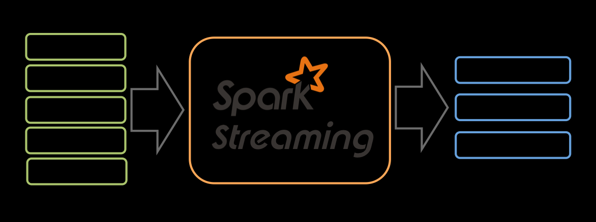
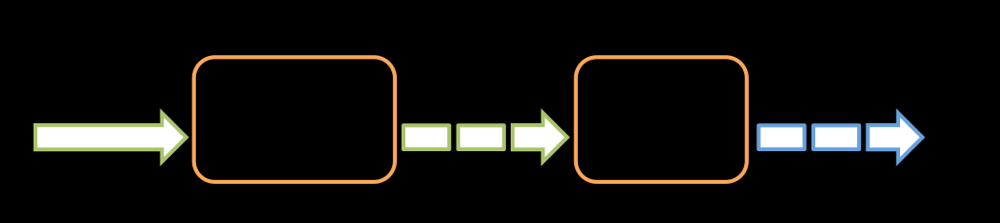

##### spark streaming

* [官网](http://spark.apache.org/streaming/)
* [文档](http://spark.apache.org/docs/latest/streaming-programming-guide.html)

#####
    spark streaming基本原理为将输入数据流以时间片为单位进行拆分，然后以批处理的方式处理每个时间片的数据。

    Spark Streaming使用DSTream来表示一个连续的数据流。